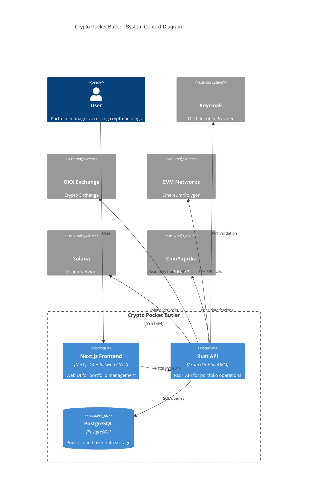
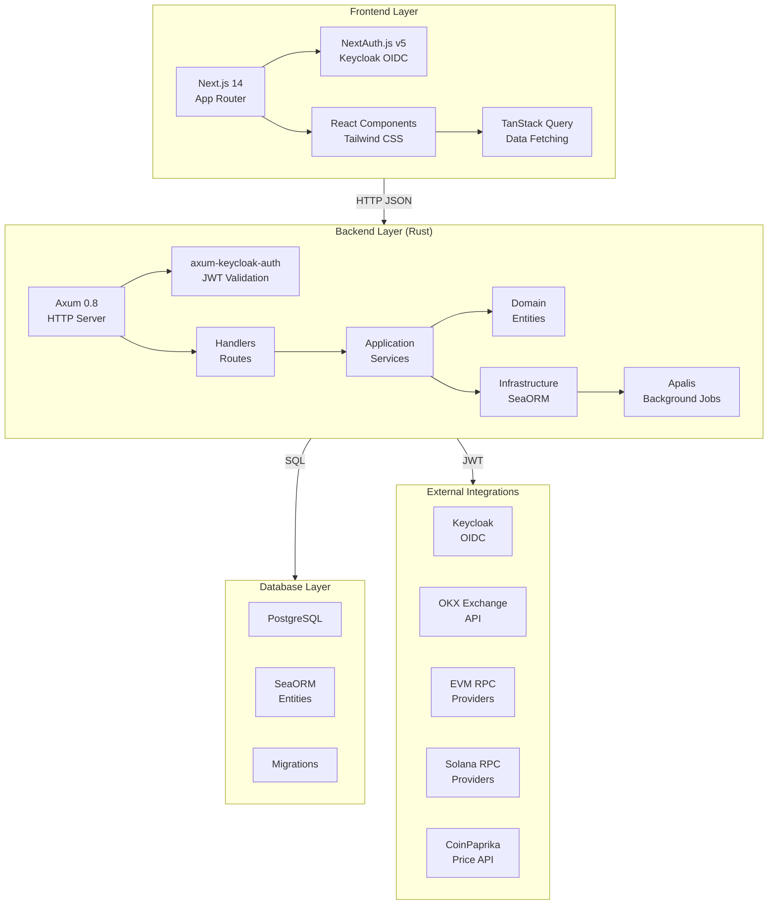
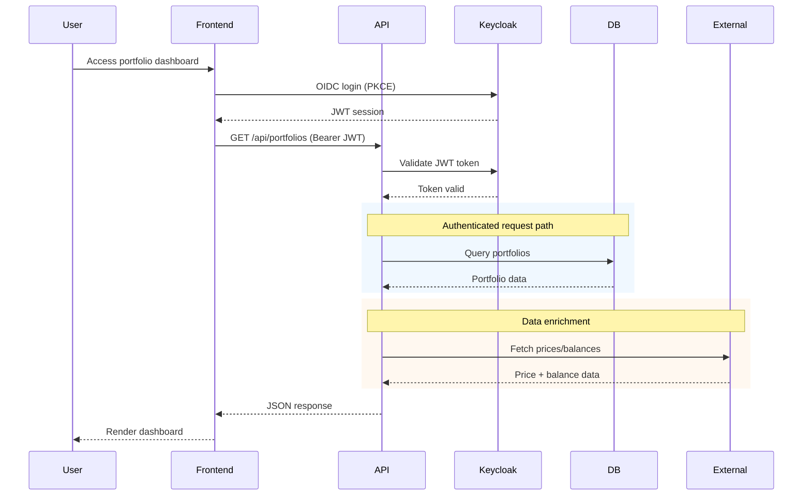
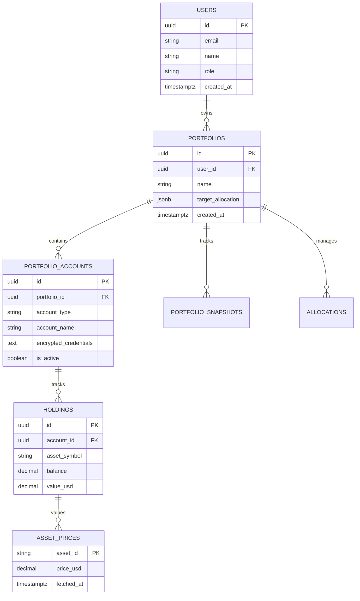

# Current Architecture

Visual diagram of the crypto-pocket-butler system architecture.

## System Overview

## Component Architecture

## Data Flow Architecture

## Database Schema (Core Entities)

## Technology Stack Summary

| Layer | Technology | Purpose |
|-------|------------|---------|
| Frontend Framework | Next.js 14 | App Router, SSR/RSC |
| Frontend Styling | Tailwind CSS 4 | Pure Tailwind (no UI libs) |
| Frontend Auth | NextAuth.js v5 | Keycloak OIDC + PKCE |
| Backend Framework | Axum 0.8 | HTTP server |
| ORM | SeaORM | Database models |
| Database | PostgreSQL | Persistent storage |
| Auth | Keycloak | JWT validation |
| API Docs | utoipa | OpenAPI/Swagger |
| Background Jobs | Apalis | Async task processing |
| External APIs | OKX, EVM RPC, Solana, CoinPaprika | Market data |