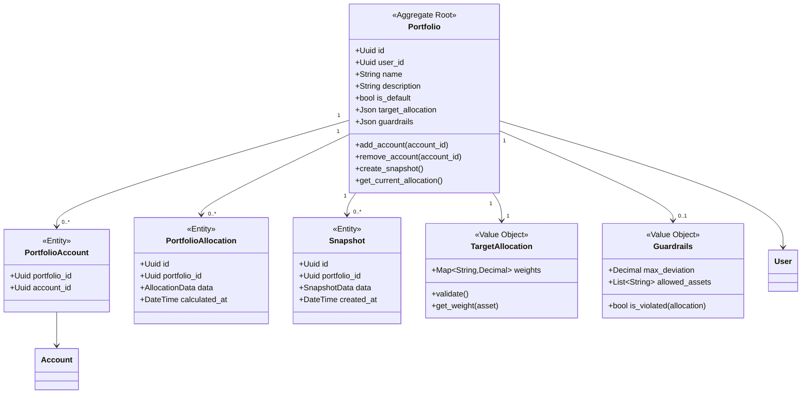
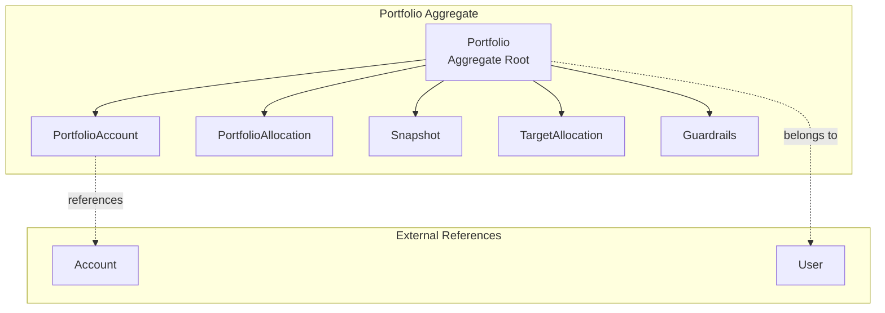
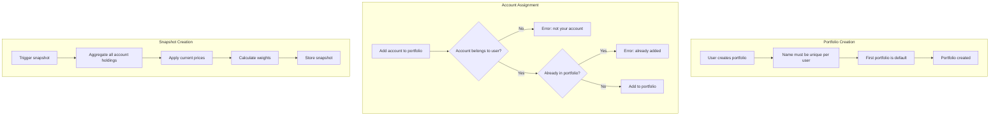
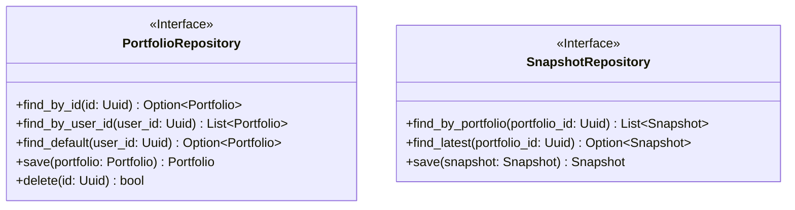

# Portfolio Domain

> **Bounded Context:** Portfolio management, target allocations, and snapshots.
> **Aggregate Root:** Portfolio

---

## Domain Model

---

## Aggregate Boundaries

---

## Business Rules

---

## Invariants

| Invariant | Description |
|-----------|-------------|
| Unique name | Portfolio name must be unique per user |
| Default portfolio | Each user has exactly one default portfolio |
| Account ownership | Only accounts owned by user can be added |
| Target allocation weights | Must sum to 100% (if defined) |
| Guardrail deviation | Alert if allocation deviates beyond threshold |

---

## Repository Interface

---

## Events

| Event | Trigger | Description |
|-------|---------|-------------|
| PortfolioCreated | User creates portfolio | New portfolio initialized |
| AccountAdded | Account added to portfolio | Link created |
| AccountRemoved | Account removed from portfolio | Link removed |
| SnapshotCreated | Snapshot completed | Point-in-time record |
| AllocationChanged | Deviation from target | Guardrail alert |