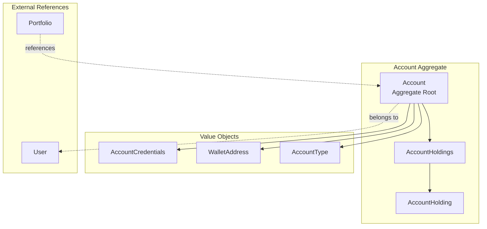
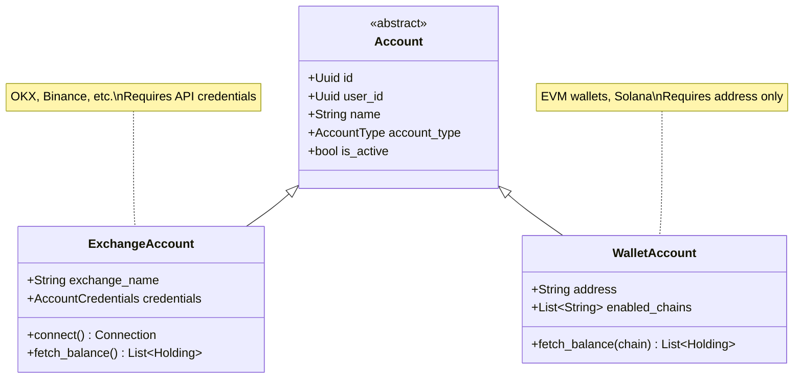
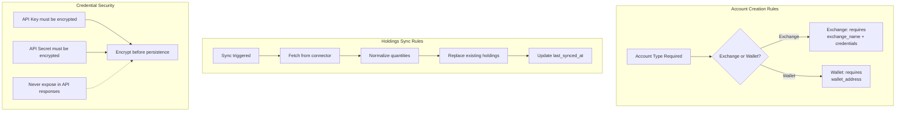
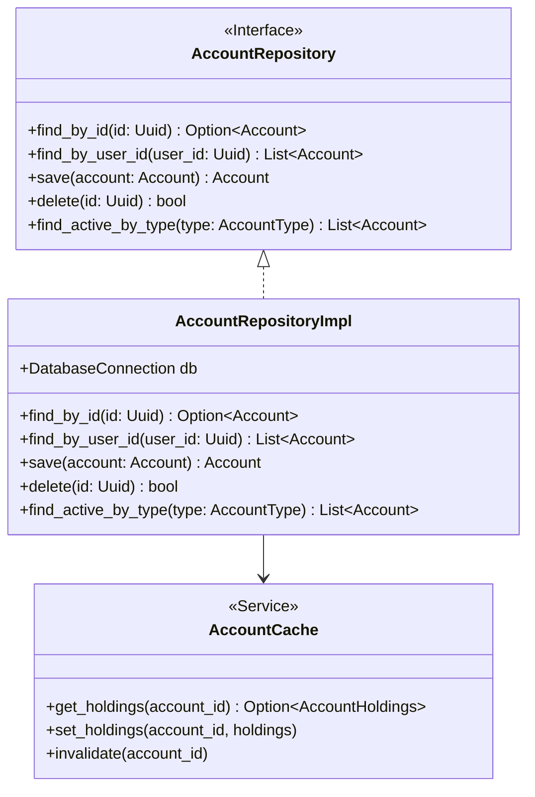
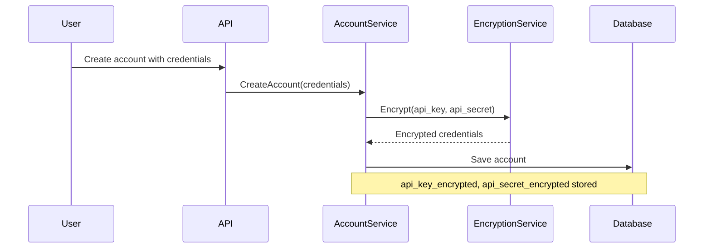

# Account Domain

> **Bounded Context:** Account management, credentials, and holdings storage.
> **Aggregate Root:** Account

---

## Domain Model

```mermaid
classDiagram
    class Account {
        <<Aggregate Root>>
        +Uuid id
        +Uuid user_id
        +String name
        +AccountType account_type
        +bool is_active
        +DateTime last_synced_at
        +DateTime created_at
        +DateTime updated_at
        +add_holding(holding)
        +remove_holding(asset)
        +sync_holdings(holdings)
        +activate()
        +deactivate()
    }
    
    class AccountType {
        <<Enumeration>>
        EXCHANGE
        WALLET
    }
    
    class ExchangeAccount {
        +String exchange_name
        +AccountCredentials credentials
    }
    
    class WalletAccount {
        +String address
        +List~String~ enabled_chains
    }
    
    class AccountCredentials {
        <<Value Object>>
        +String api_key_encrypted
        +String api_secret_encrypted
        +String passphrase_encrypted
    }
    
    class AccountHolding {
        <<Entity>>
        +String asset
        +Decimal quantity
        +Decimal available
        +Decimal frozen
        +u8 decimals
        +Decimal total_value_usd
    }
    
    class AccountHoldings {
        <<Value Object>>
        +List~AccountHolding~ items
        +Decimal total_value_usd
        +add(holding)
        +remove(asset)
        +find(asset)
    }
    
    Account "1" --> "1" AccountType
    Account <|-- ExchangeAccount
    Account <|-- WalletAccount
    ExchangeAccount "1" --> "1" AccountCredentials
    WalletAccount "1" --> "*" String : enabled_chains
    Account "1" --> "1" AccountHoldings : holdings
    AccountHoldings "1" --> "*" AccountHolding
```

---

## Aggregate Boundaries

---

## Account Type Hierarchy

---

## Business Rules

---

## Invariants

| Invariant | Description |
|-----------|-------------|
| Valid account type | Must be EXCHANGE or WALLET |
| Exchange requirements | exchange_name and credentials required for EXCHANGE type |
| Wallet requirements | wallet_address required for WALLET type |
| Credential encryption | API credentials must be encrypted before storage |
| Holdings normalization | All quantities stored as normalized decimal strings |
| User ownership | Account must belong to a valid user |

---

## Repository Interface

---

## Events

| Event | Trigger | Description |
|-------|---------|-------------|
| AccountCreated | User creates account | New account initialized |
| AccountActivated | Account activated | Ready for sync |
| AccountDeactivated | Account deactivated | Paused from sync |
| HoldingsSynced | Sync completed | Holdings updated |
| CredentialsUpdated | Credentials changed | Re-encrypted and stored |
| SyncFailed | Sync error | Error logged, alert if needed |

---

## Security Considerations

### Credential Storage

### API Response Security

- Credentials are **never** returned in API responses
- `api_key_encrypted`, `api_secret_encrypted`, `passphrase_encrypted` use `#[serde(skip_serializing)]`
- Only metadata (account type, name, last_synced_at) is exposed