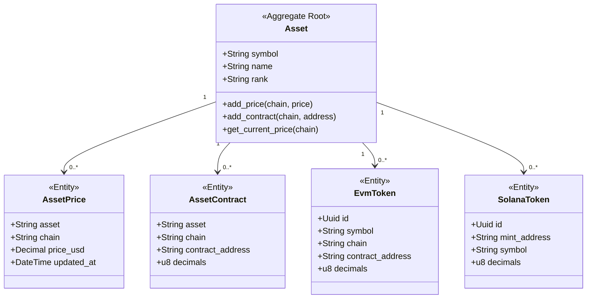
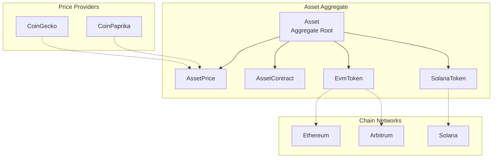
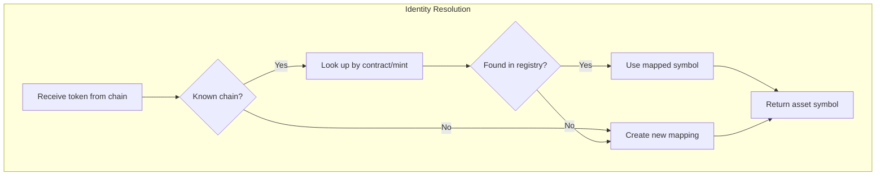
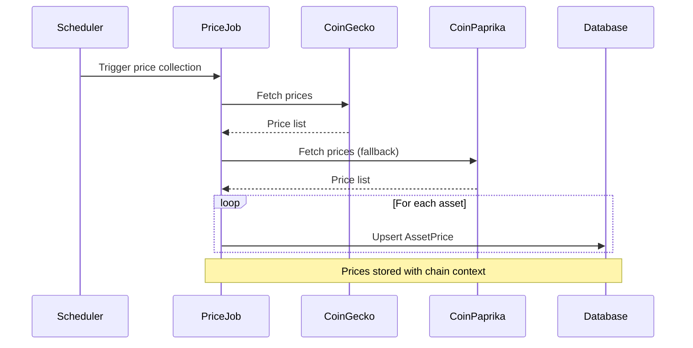
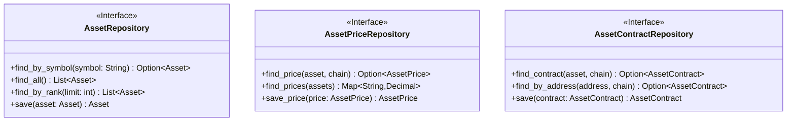

# Asset Domain

> **Bounded Context:** Asset definitions, pricing, and contract addresses.
> **Aggregate Root:** Asset

---

## Domain Model

---

## Aggregate Boundaries

---

## Asset Identity Resolution

---

## Price Collection Flow

---

## Business Rules

| Rule | Description |
|------|-------------|
| Symbol uniqueness | Asset symbol must be unique across the system |
| Chain-specific prices | Same asset can have different prices per chain |
| Contract uniqueness | One contract address per asset per chain |
| Rank updates | Asset rank updated from price providers |
| Decimals preserved | Token decimals stored for balance normalization |

---

## Repository Interface

---

## Events

| Event | Trigger | Description |
|-------|---------|-------------|
| PriceUpdated | New price fetched | Asset price changed |
| AssetAdded | New asset discovered | Added to registry |
| ContractAdded | New contract mapped | Chain-specific address |
| RankUpdated | Rank changed | Asset ranking updated |