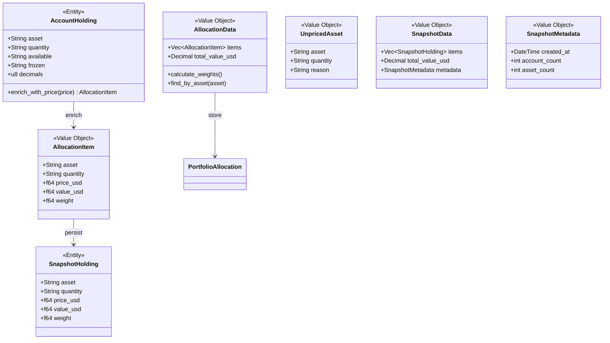
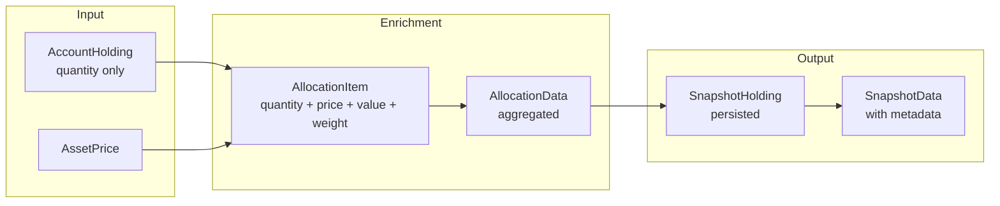
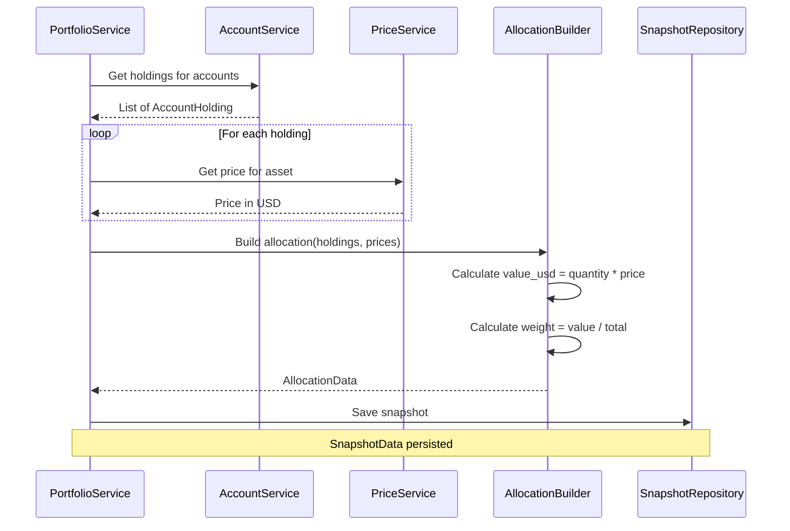
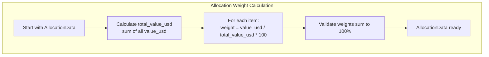
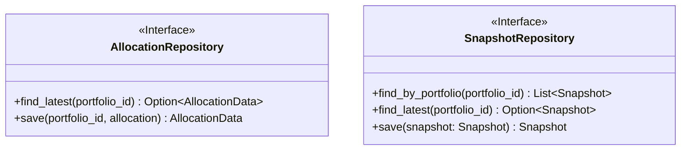

# Holding & Allocation Domain

> **Bounded Context:** Holdings enrichment, allocation calculation, and snapshot storage.
> **This domain bridges Account and Portfolio aggregates.**

---

## Domain Model



---

## Data Flow



---

## Allocation Calculation Flow



---

## Weight Calculation



### Example Calculation

| Asset | Quantity | Price USD | Value USD | Weight |
|-------|----------|-----------|-----------|--------|
| BTC | 0.5 | $50,000 | $25,000 | 50% |
| ETH | 5.0 | $3,000 | $15,000 | 30% |
| SOL | 50 | $200 | $10,000 | 20% |
| **Total** | - | - | **$50,000** | **100%** |

---

## Business Rules

| Rule | Description |
|------|-------------|
| Quantity normalization | All quantities are normalized (human-readable) decimal strings |
| Price lookup | If price not found, holding goes to UnpricedAsset list |
| Weight precision | Weights calculated to 4 decimal places |
| Snapshot immutability | Snapshots are never modified after creation |
| Metadata tracking | Account count and asset count stored with snapshot |

---

## Value Object Specifications

### AccountHolding (Input)

```json
{
  "asset": "BTC",
  "quantity": "1.5",
  "available": "1.2",
  "frozen": "0.3",
  "decimals": 8
}
```

### AllocationItem (Enriched)

```json
{
  "asset": "BTC",
  "quantity": "1.5",
  "price_usd": 50000.00,
  "value_usd": 75000.00,
  "weight": 0.45
}
```

### SnapshotHolding (Persisted)

```json
{
  "asset": "BTC",
  "quantity": "1.5",
  "price_usd": 50000.00,
  "value_usd": 75000.00,
  "weight": 0.45
}
```

---

## Invariants

| Invariant | Description |
|-----------|-------------|
| Weight sum | All weights in AllocationData must sum to 100% (or 1.0) |
| Positive values | quantity, price_usd, value_usd must be non-negative |
| Frozen ≤ Total | frozen quantity cannot exceed total quantity |
| Available + Frozen = Total | Available plus frozen should equal total quantity |

---

## Repository Interface

