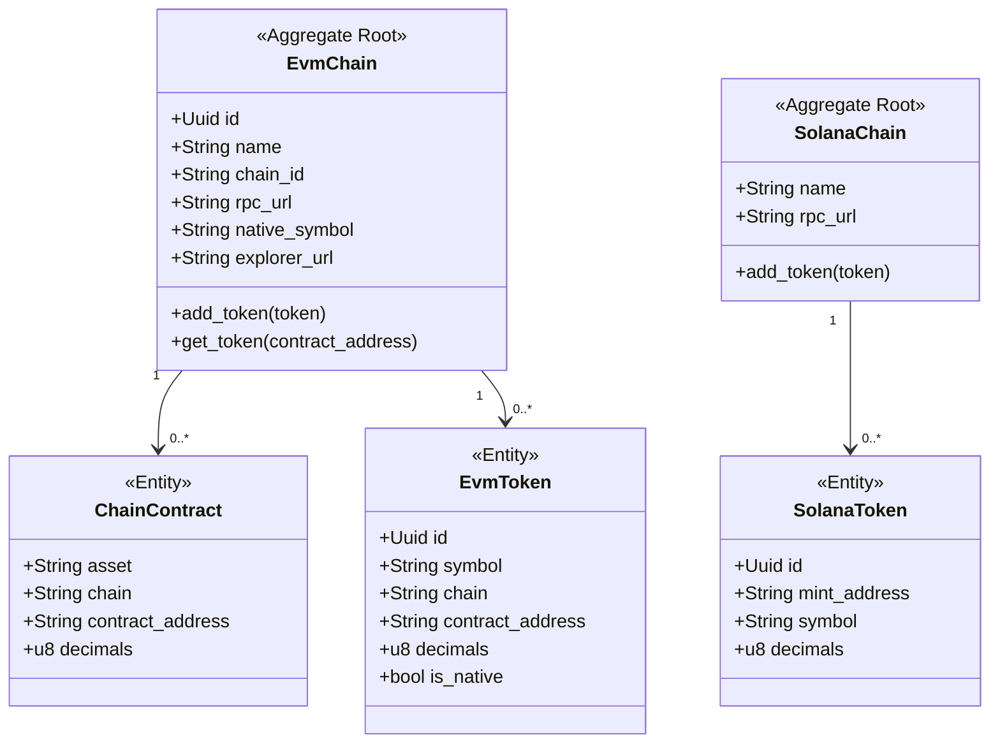
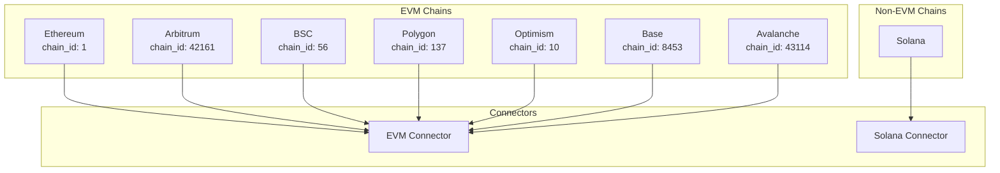
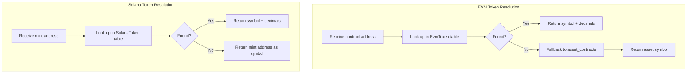
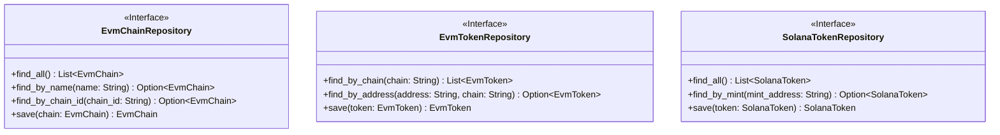

# Chain & Token Domain

> **Bounded Context:** Blockchain network configurations and token specifications.
> **Aggregate Root:** EvmChain

---

## Domain Model



---

## Supported Chains



---

## Token Resolution Flow



---

## Chain Configuration

### EVM Chain Properties

| Property | Type | Description |
|----------|------|-------------|
| id | Uuid | Unique identifier |
| name | String | Display name (e.g., "ethereum") |
| chain_id | String | Chain ID for RPC calls |
| rpc_url | String | JSON-RPC endpoint |
| native_symbol | String | Native token symbol (e.g., "ETH") |
| explorer_url | String | Block explorer URL |

### Example Configuration

```json
{
  "id": "uuid-here",
  "name": "ethereum",
  "chain_id": "1",
  "rpc_url": "https://eth.llamarpc.com",
  "native_symbol": "ETH",
  "explorer_url": "https://etherscan.io"
}
```

---

## Business Rules

| Rule | Description |
|------|-------------|
| Native tokens | Each chain has a native token (ETH, BNB, SOL) |
| Contract uniqueness | One contract address per token per chain |
| Chain validation | Only configured chains can be queried |
| Enabled chains per wallet | Users specify which chains to track |

---

## Repository Interface



---

## Token Tables Schema

### evm_tokens

| Column | Type | Description |
|--------|------|-------------|
| id | Uuid | Primary key |
| symbol | String | Token symbol |
| chain | String | Chain name |
| contract_address | String | Token contract |
| decimals | u8 | Token decimals |
| is_native | bool | Is native token? |

### solana_tokens

| Column | Type | Description |
|--------|------|-------------|
| id | Uuid | Primary key |
| mint_address | String | SPL token mint |
| symbol | String | Token symbol |
| decimals | u8 | Token decimals |

---

## Events

| Event | Trigger | Description |
|-------|---------|-------------|
| ChainAdded | New chain configured | Available for wallets |
| TokenAdded | New token discovered | Added to registry |
| TokenUpdated | Token info changed | Symbol or decimals updated |