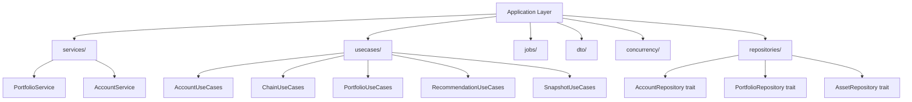
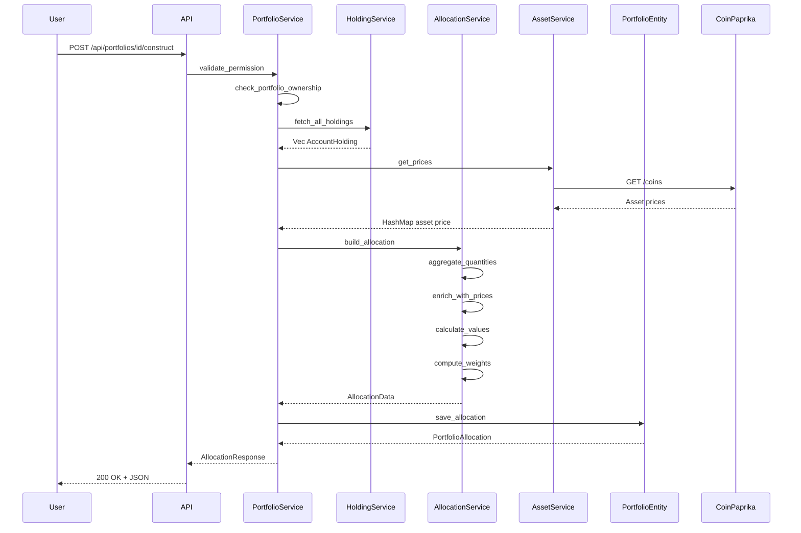

# Backend Architecture - Business Services & Logic

## Application Layer Overview

---

## Business Logic Layer

```mermaid
graph TD
    PBL[Portfolio Business Logic]
    ABL[Asset Business Logic]
    HBL[Holding Business Logic]
    ALBL[Allocation Business Logic]
    SBL[Snapshot Business Logic]
    
    VN[ValidateName]
    CD[CheckDefault]
    VG[ValidateGuardrails]
    CO[CheckOwnership]
    
    LP[LookUpPrices]
    NS[NormalizeSymbols]
    CM[CheckChainMapping]
    
    NQ[NormalizeQuantities]
    CA[CalculateAvailable]
    MA[MergeAccounts]
    
    AH[AggregateHoldings]
    EP[EnrichWithPrices]
    CV[CalculateValues]
    CW[ComputeWeights]
    
    CC[CreateCopy]
    PS[PreserveState]
    GM[GenerateMetadata]
    
    PBL --> VN
    PBL --> CD
    PBL --> VG
    PBL --> CO
    
    ABL --> LP
    ABL --> NS
    ABL --> CM
    
    HBL --> NQ
    HBL --> CA
    HBL --> MA
    
    ALBL --> AH
    ALBL --> EP
    ALBL --> CV
    ALBL --> CW
    
    SBL --> CC
    SBL --> PS
    SBL --> GM
```

---

## High-Level Business Flow: Portfolio Construction

---

## Clean Architecture Layer Map

| Layer | Components |
|-------|------------|
| **Domain Layer** | Account, Allocation, Asset, Chain, Portfolio domains |
| **Application Layer** | AccountUseCases, ChainUseCases, PortfolioUseCases, SnapshotUseCases, RecommendationUseCases |
| **Application Services** | PortfolioService, AccountService |
| **Repository Traits** | AccountRepository, PortfolioRepository, AssetRepository |
| **Infrastructure** | SeaORM Entities, PostgreSQL, Keycloak, EVM/OKX/Solana connectors |
| **Transport** | Axum HTTP handlers, routes, error mapping |