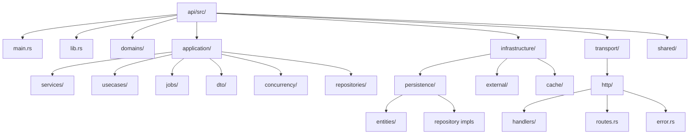
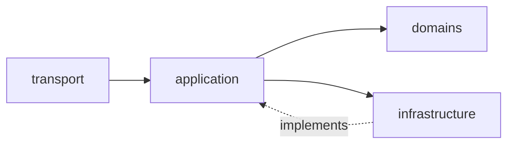
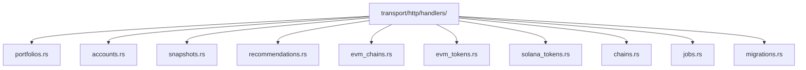
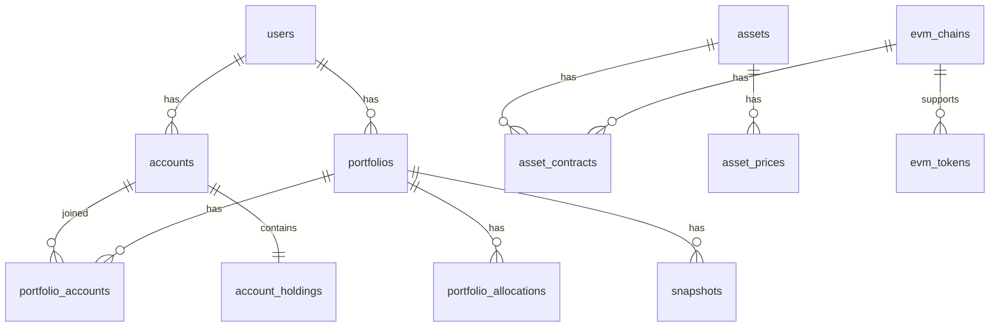

# Backend Architecture - Code Structure

## Code Structure Design



---

## Layer Dependency Flow



---

## HTTP Handler Structure



---

## Database Entity Relationships



---

## Layer Descriptions

| Layer | Location | Responsibility |
|-------|----------|----------------|
| **Domain Layer** | `api/src/domains/` | Business entities and rules, no external dependencies |
| **Application Layer** | `api/src/application/` | Use cases, services, repository traits, orchestration |
| **Infrastructure Layer** | `api/src/infrastructure/` | Persistence, external APIs, caching — implements application interfaces |
| **Transport Layer** | `api/src/transport/` | HTTP handlers, routes, error mapping |

---

## Clean Architecture Principles

### Dependency Direction Rules

Dependencies always point **inward**: Transport → Application → Domain. Infrastructure implements interfaces defined by the Application layer, so the domain and application layers never depend on infrastructure details.

### Why Handlers Don't Call Infrastructure Directly

HTTP handlers (in `transport/http/handlers/`) receive injected use cases and services via Axum `Extension` state. They never import from `infrastructure/` directly. This keeps the transport layer decoupled from persistence and external-API concerns, making handlers independently testable.

### Repository Pattern

Repository *traits* are declared in `application/repositories/` (e.g. `AccountRepository`, `PortfolioRepository`). Concrete implementations live in `infrastructure/persistence/` (e.g. `AccountRepositoryImpl`). The application layer depends only on the trait, not the implementation.

### Use Case Pattern

Each domain-facing operation is encapsulated in a use-case struct under `application/usecases/` (e.g. `AccountUseCases`, `ChainUseCases`, `PortfolioUseCases`). Use cases are constructed once at startup in `main.rs`, wrapped in `Arc`, and shared across handlers via Axum `Extension` injection.

---

## SOLID Principles

The Clean Architecture is reinforced by applying SOLID principles at every layer.

### S — Single Responsibility Principle

Every struct, module, and layer owns exactly one concern:

| Unit | Single Responsibility |
|------|-----------------------|
| HTTP handler (e.g. `portfolios.rs`) | Parse HTTP request → call one use case → serialize response |
| Use case struct (e.g. `PortfolioUseCases`) | Orchestrate one domain aggregate's operations |
| Repository trait (e.g. `PortfolioRepository`) | Persist / retrieve one aggregate only |
| Domain entity (e.g. `Portfolio`) | Enforce invariants and business rules for that aggregate |
| Infrastructure impl (e.g. `AccountRepositoryImpl`) | Execute DB queries for one repository contract |

A handler MUST NOT contain business logic. A use case MUST NOT contain HTTP concerns.
A domain entity MUST NOT contain persistence logic.

### O — Open/Closed Principle

The system MUST be open for extension and closed for modification:

- **New EVM chains/tokens**: add a DB row — no existing code changes (Principle IV).
- **New use case**: add a new struct under `application/usecases/` — no modification to
  existing use cases or handlers required.
- **New repository implementation** (e.g., for a different DB backend): implement the existing
  trait in `infrastructure/persistence/` — the application layer is unaffected.
- **New HTTP handler**: add a new file under `transport/http/handlers/` and register in
  `routes.rs` — no existing handler modified.

Avoid extending a module by editing its existing logic; prefer adding new structs or impls.

### L — Liskov Substitution Principle

Any concrete infrastructure implementation MUST be fully substitutable for its application
layer trait without changing the behaviour observed by callers:

- `AccountRepositoryImpl` MUST satisfy every contract specified in `AccountRepository`.
- Swapping one `PortfolioRepository` implementation for another MUST leave all use cases
  behaving identically.
- Mock implementations used in tests MUST honour the same contracts (preconditions,
  postconditions, invariants) as production implementations.

Implementations that cannot satisfy the trait contract MUST NOT implement it; instead the
trait itself should be refined or split.

### I — Interface Segregation Principle

Traits MUST be narrow and domain-specific — no "god traits":

- Repository traits are split by aggregate: `AccountRepository`, `PortfolioRepository`,
  `AssetRepository` — not one combined `Repository<T>`.
- Use case structs group only the operations that belong to one aggregate. A handler that
  needs portfolio operations depends on `PortfolioUseCases`, not a combined service.
- Background jobs depend only on the specific repository traits they actually use.

A caller MUST NOT be forced to depend on methods it does not use. If a struct requires only
`find_by_id`, it receives a trait that exposes only that method (or a minimal sub-trait).

### D — Dependency Inversion Principle

High-level modules MUST NOT depend on low-level modules. Both MUST depend on abstractions:

- The **Application layer** declares repository traits (abstractions).
  The **Infrastructure layer** implements them (details). The application never imports the impl.
- The **Transport layer** depends on use-case structs injected at startup — never on
  infrastructure types.
- **Dependency injection** is performed once in `main.rs` via Axum `Extension` registration:
  concrete impls are wired to traits there and nowhere else.
- **Testing**: unit tests substitute production infrastructure impls with in-memory or mock
  impls that implement the same traits — enabled by this inversion.

```
High-level:    Transport  →  Application (use cases, traits)
                                  ↑ (implements)
Low-level:               Infrastructure (concrete impls)
```

This is the structural guarantee that keeps the domain and application layers portable and
independently testable.