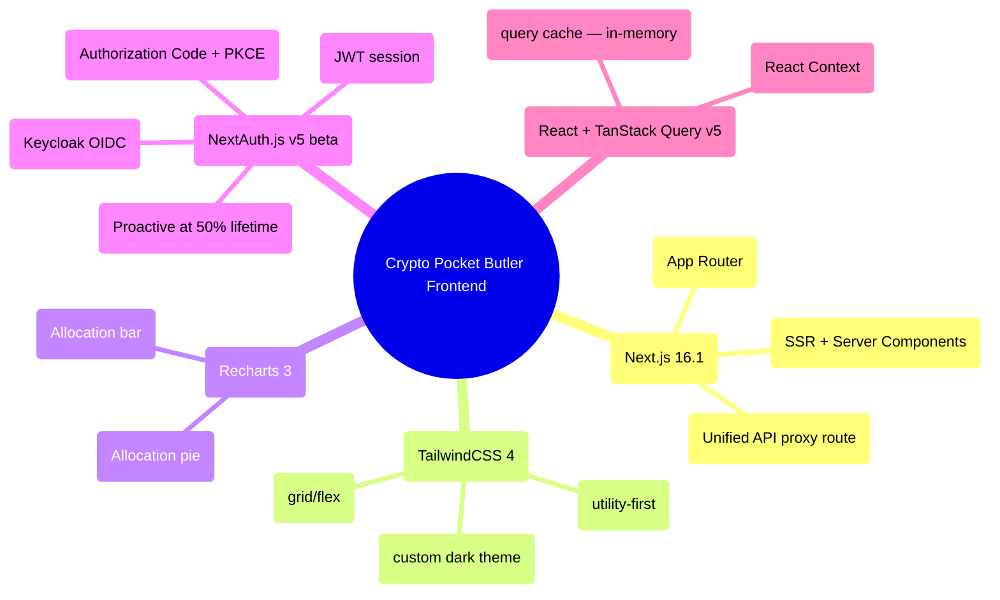
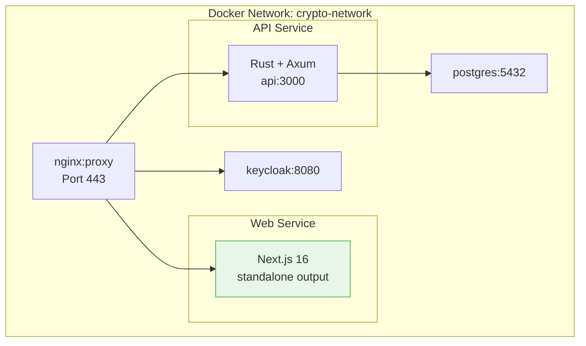
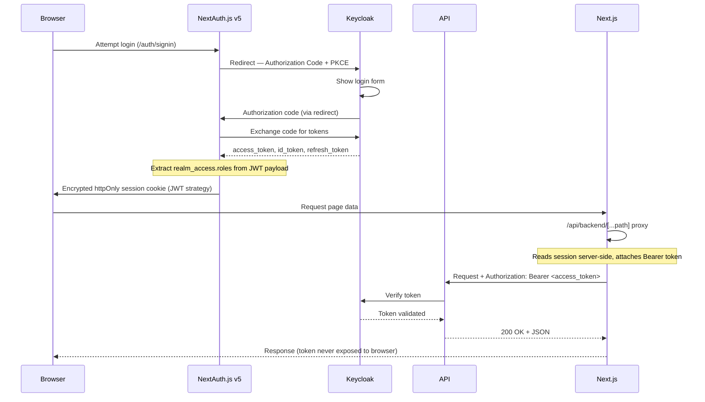
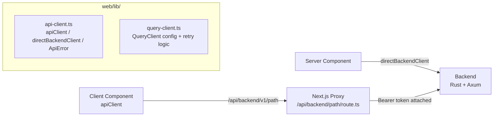
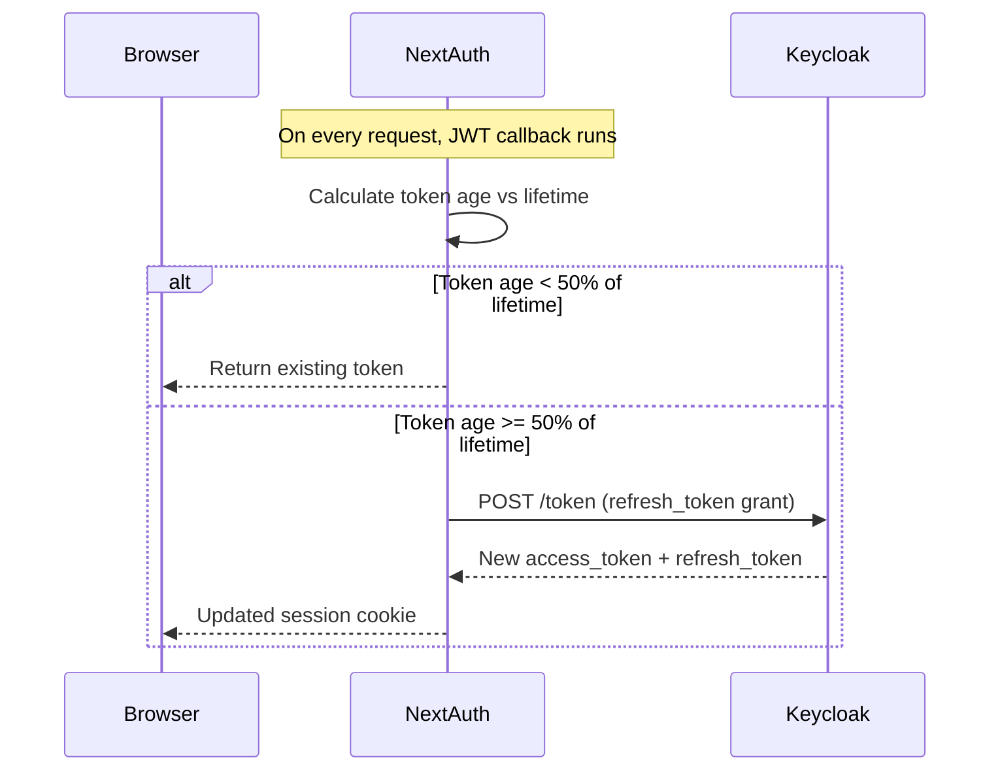
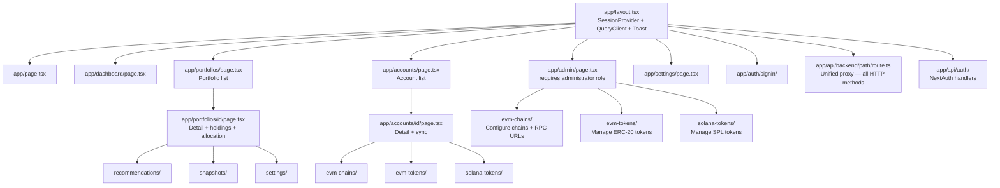
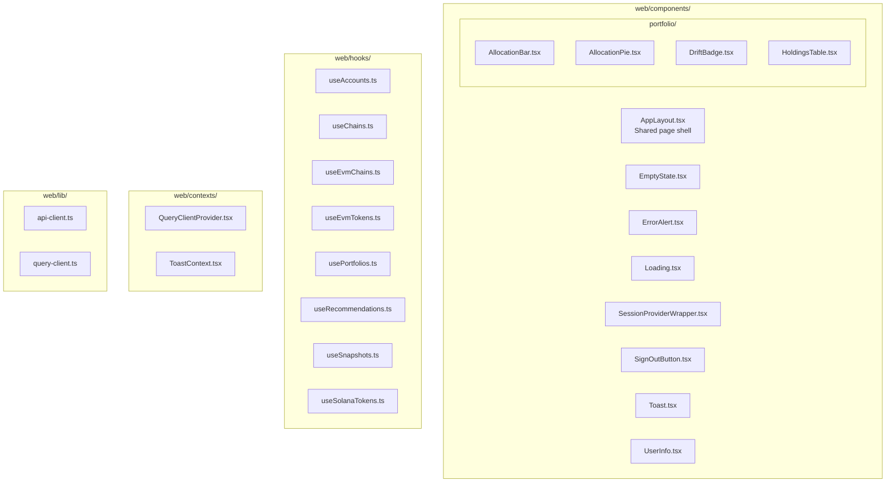
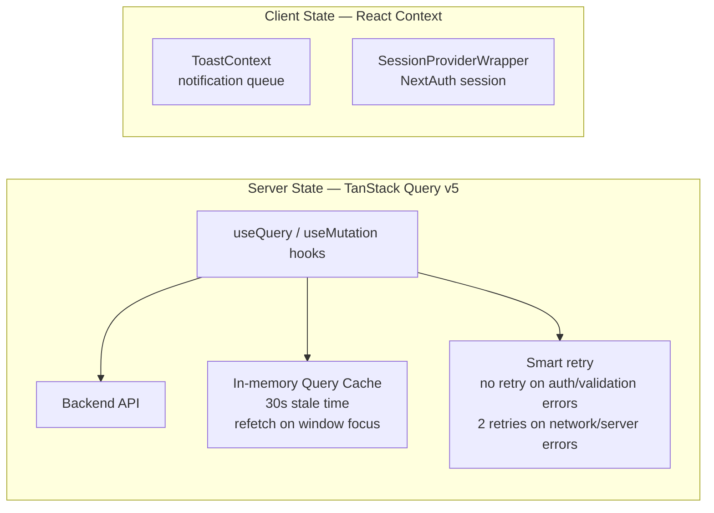
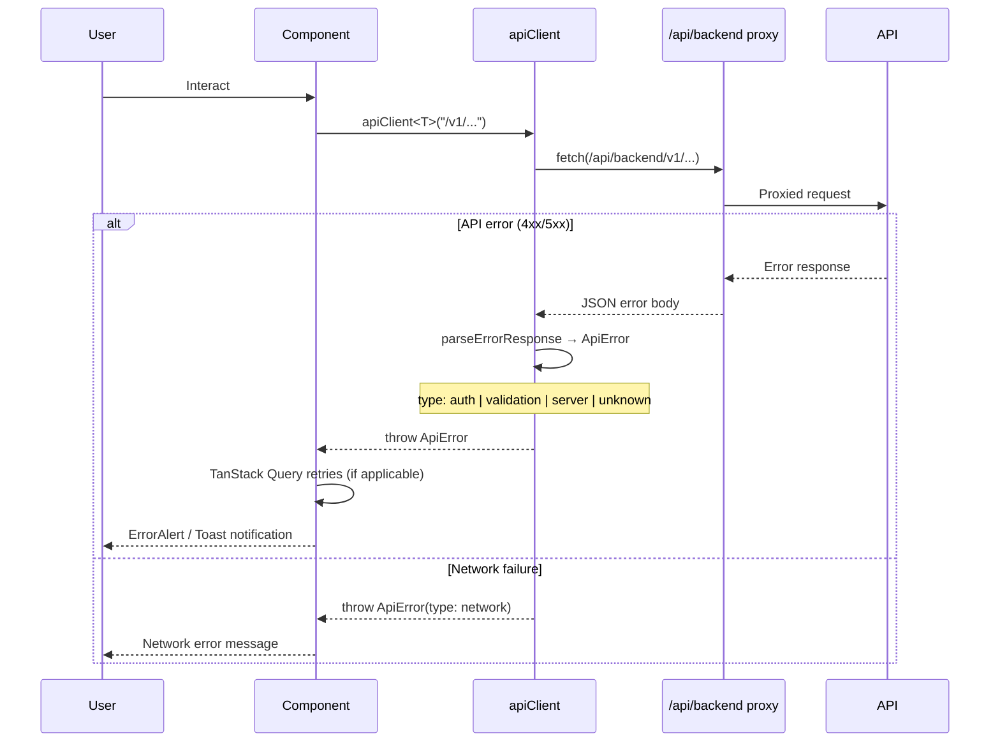
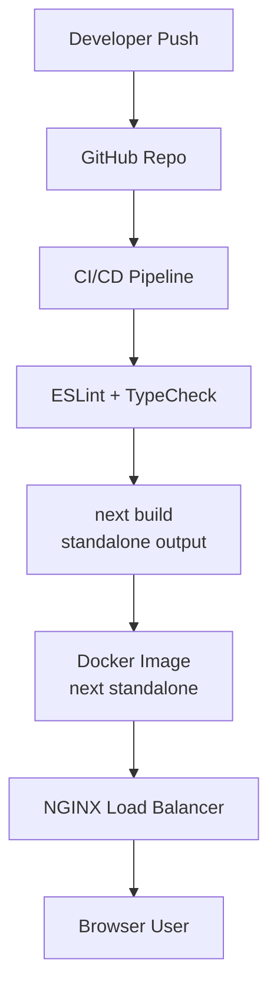

# Crypto Pocket Butler Web (Frontend) Architecture

## High-Level Web Architecture

```mermaid
graph TD
    A[Browser] -->|HTTPS| B[Load Balancer\nNGINX]
    B --> C[Next.js 16 App\nApp Router]
    B --> D[Static Assets]

    C -->|Server Components / SSR| E[API Server\nRust + Axum]
    C -->|Client Components| F[TanStack Query v5]

    F -->|In-memory cache| G[Query Cache\n30s stale time]

    C -->|Unified proxy| P[/api/backend/path\nNext.js Route Handler]
    P -->|Bearer token attached| E

    C --> I[.next/standalone]
    D --> I
```

---

## Frontend Technology Stack



---

## Web Deployment Architecture



---

## Frontend Authentication Flow



---

## Unified API Proxy

All frontend-to-backend communication goes through a single Next.js route handler.
The browser never holds or sends the access token directly.



**Request flow**:
`apiClient("/v1/accounts")` → `fetch("/api/backend/v1/accounts")` → proxy reads
session server-side → `fetch("http://api:3000/api/v1/accounts", { Authorization: Bearer ... })`

**Error types** (`ApiError`): `auth` (401/403) | `validation` (400/422) |
`server` (5xx) | `network` | `unknown`

---

## Token Refresh Strategy



Tokens are refreshed **proactively** at 50% of their lifetime — not on expiry —
to avoid mid-request failures. The `offline_access` scope ensures a refresh token
is always issued.

---

## App Router Structure



---

## Component Structure



---

## State Management



**There is no Zustand**. Client state is managed entirely through React Context.
Server/async state is managed by TanStack Query v5 with in-memory caching only —
no localStorage persistence for query data.

---

## Role-Based Access Control

```mermaid
graph TD
    User -->|Auth Code + PKCE| KC[Keycloak]
    KC -->|id_token + access_token| NA[NextAuth.js]
    NA -->|extracts realm_access.roles| Session

    Session --> MW[middleware.ts\nprotects /dashboard /portfolios /admin /api/backend]
    MW -->|unauthenticated| Redirect[/auth/signin]
    MW -->|authenticated| Routes[Protected Routes]

    Routes --> AdminCheck{roles includes\nadministrator?}
    AdminCheck -->|Yes| AdminPages[/admin/*\nEVM chains, tokens, Solana tokens]
    AdminCheck -->|No| Redirect2[/dashboard]
```

The required admin role claim is **`"administrator"`** (Keycloak realm role, extracted
from `realm_access.roles` in the JWT payload). Standard authenticated users cannot
access `/admin/*` routes — they are redirected to `/dashboard`.

---

## Frontend Error Handling



---

## Frontend Deployment Flow



Next.js is built with `output: 'standalone'` — the Docker image includes only the
production server files without `node_modules`, keeping the image size minimal.

---

## Frontend Development Task Patterns

This section guides agents generating `tasks.md` for frontend features. All task generation
MUST follow the constitution's task-driven workflow (`/speckit.tasks`).

### Path Conventions

| Task type | Location |
|-----------|----------|
| New page route | `web/app/<route>/page.tsx` |
| New route layout | `web/app/<route>/layout.tsx` |
| New route loading state | `web/app/<route>/loading.tsx` |
| New route error boundary | `web/app/<route>/error.tsx` |
| Shared UI component | `web/components/<ComponentName>.tsx` |
| Domain UI component | `web/components/<domain>/<ComponentName>.tsx` |
| Data-fetching hook | `web/hooks/use<Domain>.ts` |
| Context provider | `web/contexts/<Name>Context.tsx` |
| Type definitions | `web/types/<domain>.ts` |
| Low-level utility | `web/lib/<name>.ts` |

### Standard Task Phases for Frontend Features

#### Phase 1: Setup (shared infrastructure — if new feature needs it)

```
- [ ] T001 Create route directory web/app/<route>/
- [ ] T002 [P] Add TypeScript types for <Domain> in web/types/<domain>.ts
- [ ] T003 [P] Add API error handling for new endpoint in web/lib/api-client.ts (if new error type)
```

#### Phase 2: Foundational (blocking prerequisites)

```
- [ ] T004 Add data-fetching hook web/hooks/use<Domain>.ts
         (uses apiClient, wraps useQuery / useMutation)
- [ ] T005 [P] Add context provider if new shared state needed in web/contexts/<Name>Context.tsx
- [ ] T006 [P] Add middleware matcher entry in web/middleware.ts (if new protected route)
```

#### Phase 3+: User Story Implementation

```
# Page
- [ ] TXXX [USn] Create page component web/app/<route>/page.tsx
- [ ] TXXX [USn] Create layout (if needed) web/app/<route>/layout.tsx
- [ ] TXXX [USn] Create loading skeleton web/app/<route>/loading.tsx

# Components (can be parallel if different files)
- [ ] TXXX [P] [USn] Create <ComponentA> in web/components/<domain>/<ComponentA>.tsx
- [ ] TXXX [P] [USn] Create <ComponentB> in web/components/<domain>/<ComponentB>.tsx

# Integration
- [ ] TXXX [USn] Wire hook into page — replace static data with useQuery calls
- [ ] TXXX [USn] Add error state handling using ErrorAlert component
- [ ] TXXX [USn] Add empty state using EmptyState component
```

#### Polish Phase

```
- [ ] TXXX [P] Add loading states (Loading component or skeleton)
- [ ] TXXX [P] Add Toast notifications for mutation success/failure
- [ ] TXXX Update docs/architecture/02-web-frontend.md if structure changed
- [ ] TXXX TypeScript strict-mode check — no implicit `any`
- [ ] TXXX Run ESLint: pnpm lint
```

### Key Constraints for Task Generation

1. **No data fetching in components** — always delegate to a hook in `web/hooks/`.
2. **No direct backend calls** — all API calls via `apiClient()` through the proxy.
3. **No state libraries** — use React Context or TanStack Query only.
4. **Protected routes** — add new route paths to `web/middleware.ts` matcher in the same task
   that creates the route.
5. **Admin routes** — any route under `web/app/admin/` MUST include a role guard checking
   `session.roles?.includes("administrator")`.
6. **Mutation tasks** — use `useMutation` from TanStack Query + Toast notification on
   success/error. Never optimistically update without invalidating the relevant query.
7. **TypeScript** — all new files MUST be `.tsx` or `.ts`. No `.js` or `.jsx`.

### Dependency Order Within a User Story

```
Types → Hook → Component(s) → Page → Integration → Error/Loading states → Docs update
```

Components and types within a story can be created in parallel (mark `[P]`) since they
are in different files. The page integration task depends on the hook and components.
