# Crypto Pocket Butler Backend API Architecture

## Domain-Driven Architecture

### Layered Architecture (Domain Model)

```mermaid
graph TB
    API Layer
    Domain Layer
    Entity Layer
    External
    API --> Domain
    Domain --> Entity
    Entity --> PostgreSQL
    Domain --> Connectors
    Connectors --> APIs
```

---

## Domain Model Structure

### Portfolio Domain

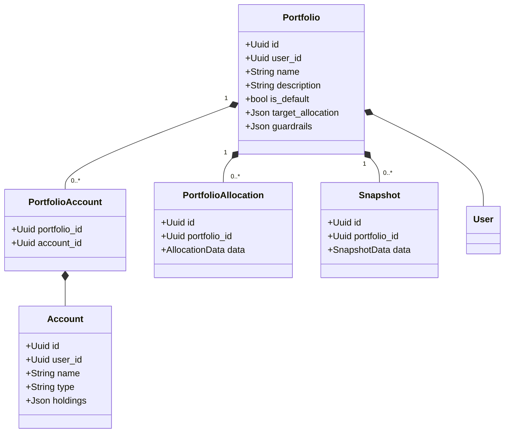

---

### Asset Domain

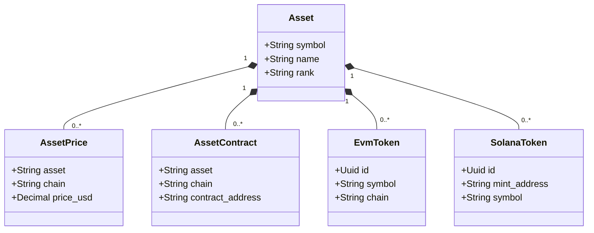

---

### Holding & Allocation Domain

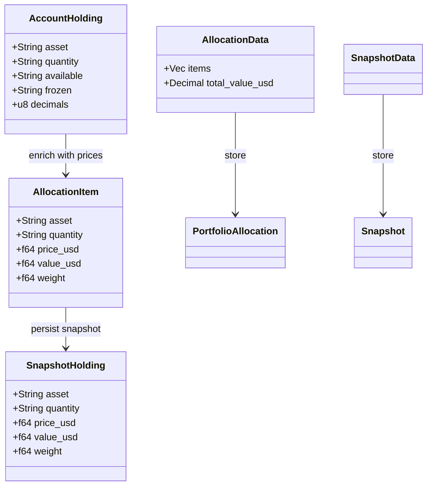

---

### Chain & Token Domain

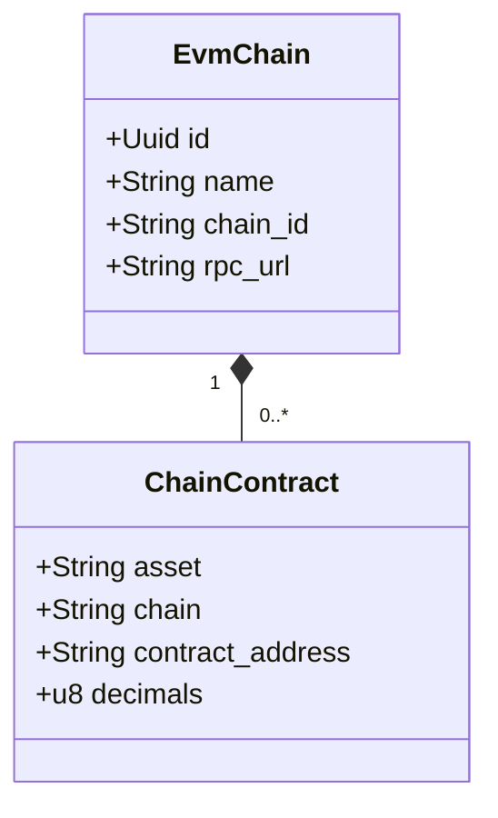

---

## API Endpoint Architecture

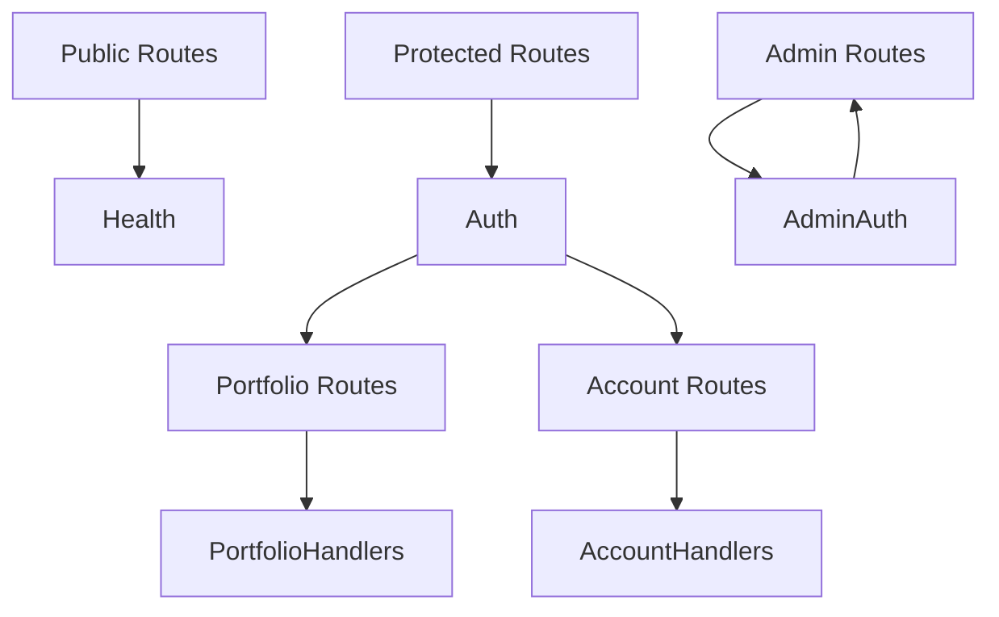

---

## Data Flow: Create Portfolio

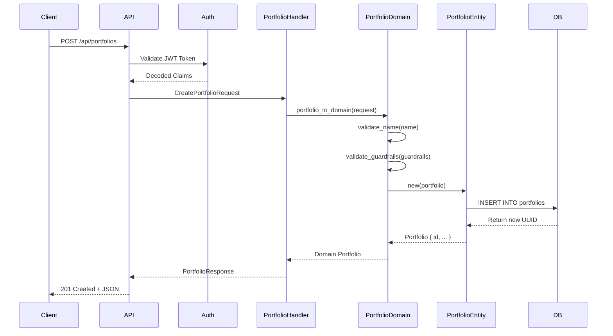

---

## Domain Model Validation Flow

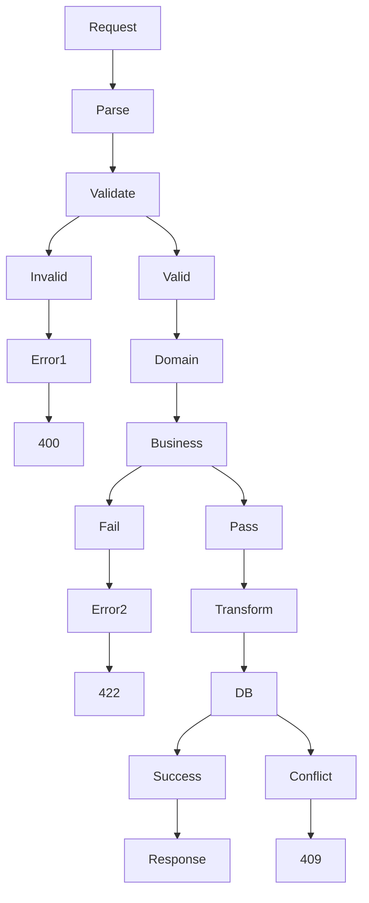

---

## Business Services Layer

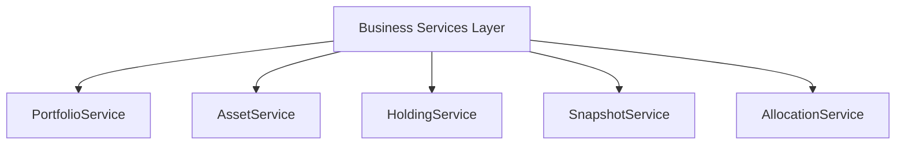

---

## Business Logic Layer

```mermaid
graph TD
    PortfolioBusinessLogic[Portfolio Business Logic]
    AssetBusinessLogic[Asset Business Logic]
    HoldingBusinessLogic[Holding Business Logic]
    AllocationBusinessLogic[Allocation Business Logic]
    SnapshotBusinessLogic[Snapshot Business Logic]
    
    PortfolioBusinessLogic --> ValidateName
    PortfolioBusinessLogic --> CheckDefault
    PortfolioBusinessLogic --> ValidateGuardrails
    PortfolioBusinessLogic --> CheckOwnership
    
    AssetBusinessLogic --> LookUpPrices
    AssetBusinessLogic --> NormalizeSymbols
    AssetBusinessLogic --> CheckChainMapping
    
    HoldingBusinessLogic --> NormalizeQuantities
    HoldingBusinessLogic --> CalculateAvailable
    HoldingBusinessLogic --> MergeAccounts
    
    AllocationBusinessLogic --> AggregateHoldings
    AllocationBusinessLogic --> EnrichWithPrices
    AllocationBusinessLogic --> CalculateValues
    AllocationBusinessLogic --> ComputeWeights
    
    SnapshotBusinessLogic --> CreateCopy
    SnapshotBusinessLogic --> PreserveState
    SnapshotBusinessLogic --> GenerateMetadata
```

---

## High-Level Business Flow: Portfolio Construction

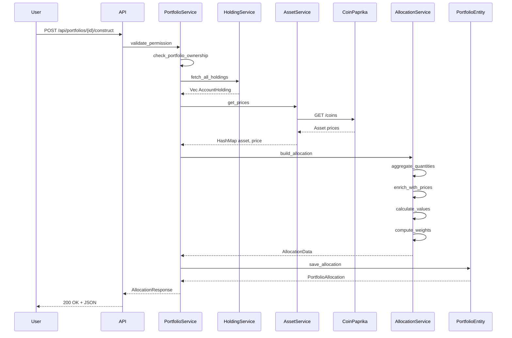

---

## Business Rules Validation

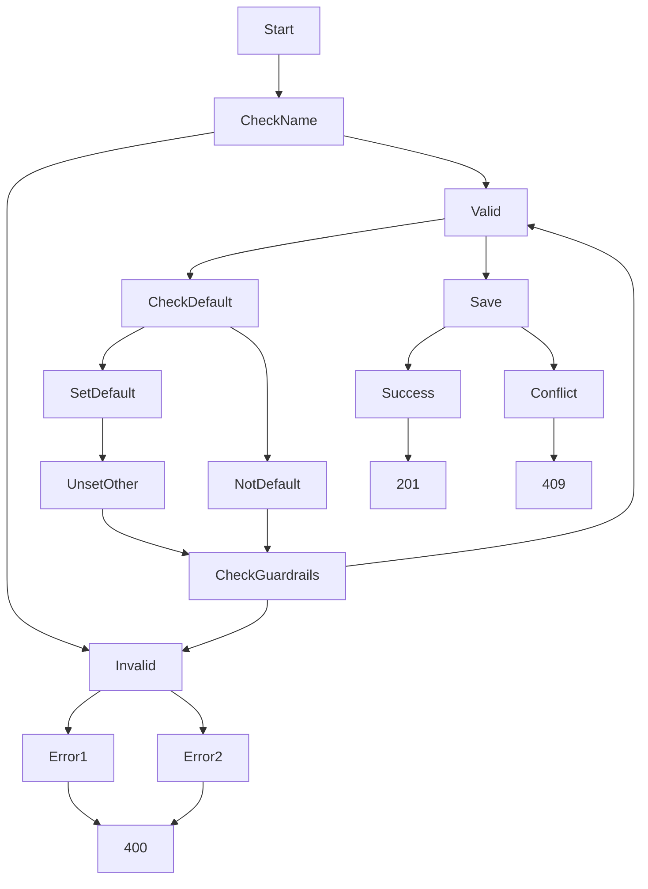

---

## Domain-Driven Design Principles Applied

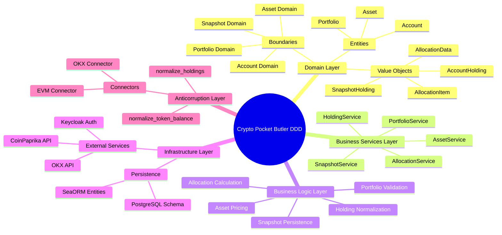

---

## Code Structure Design

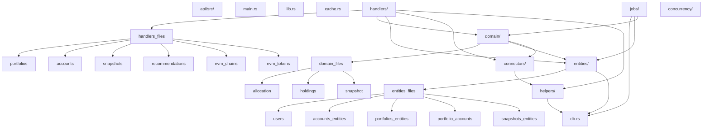

---

## Module Dependency Flow

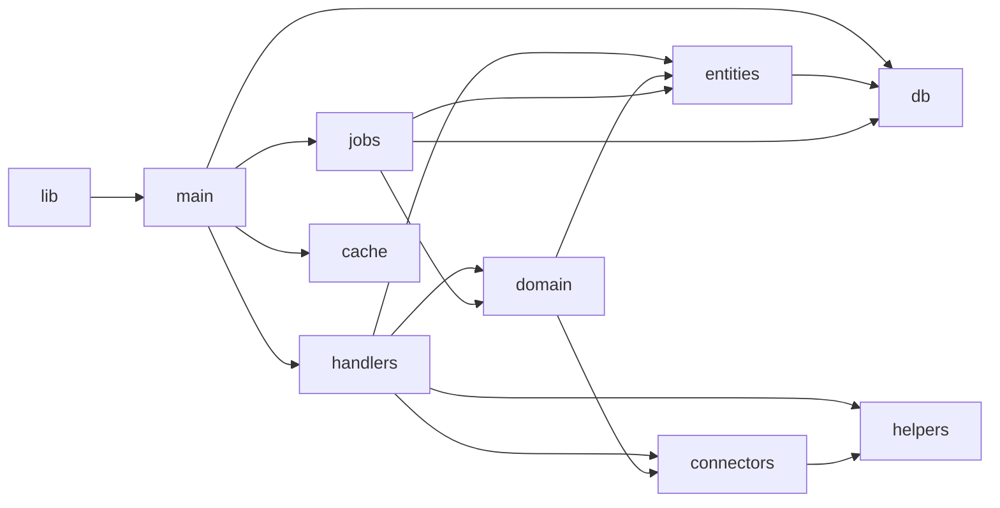

---

## API Handler Structure

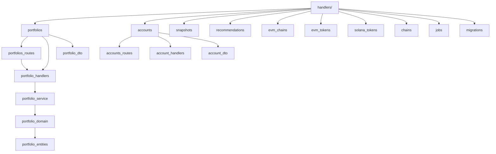

---

## Database Entity Relationships

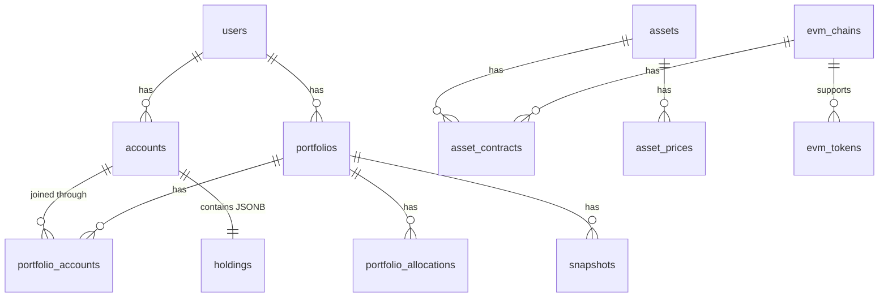
