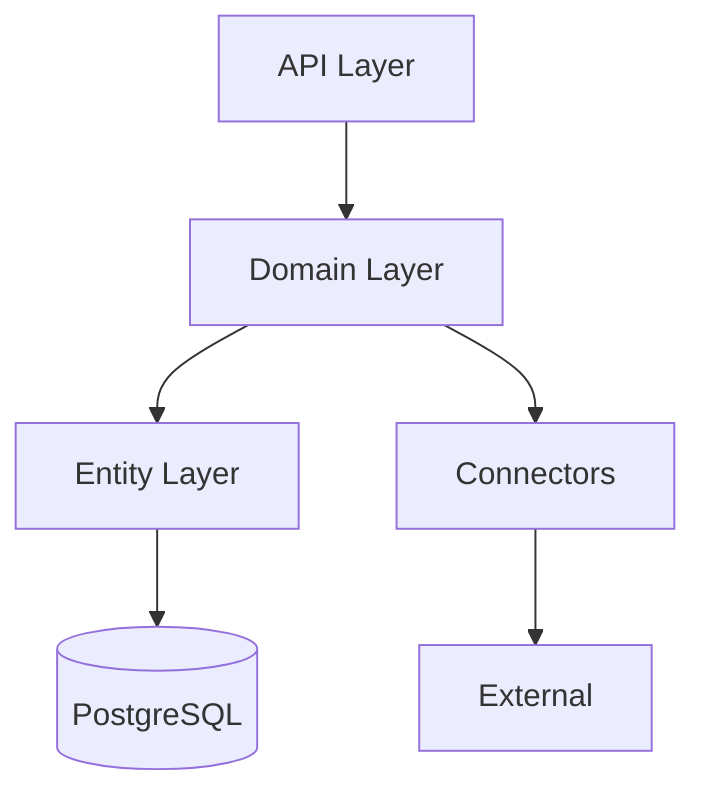
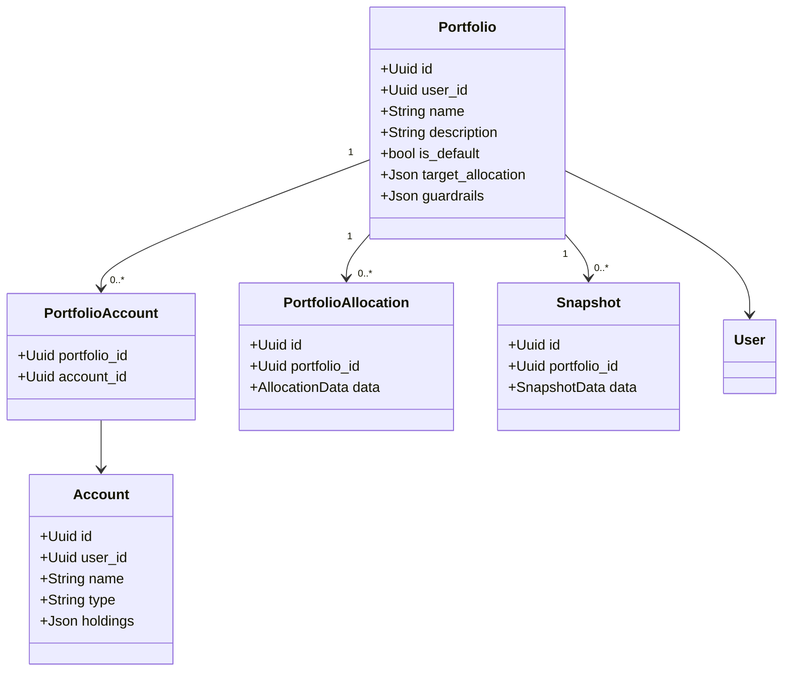
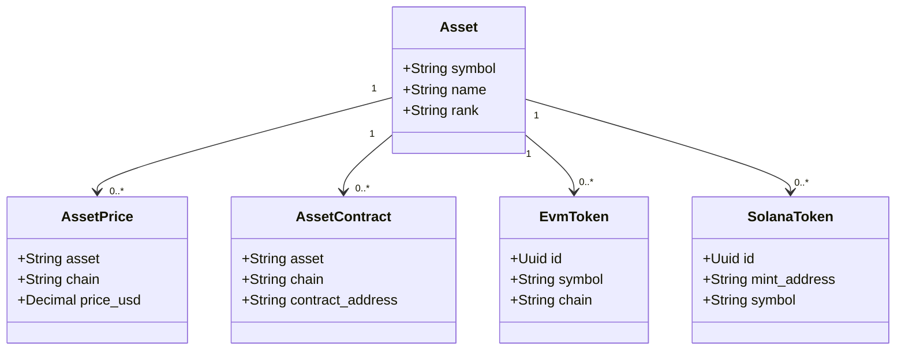
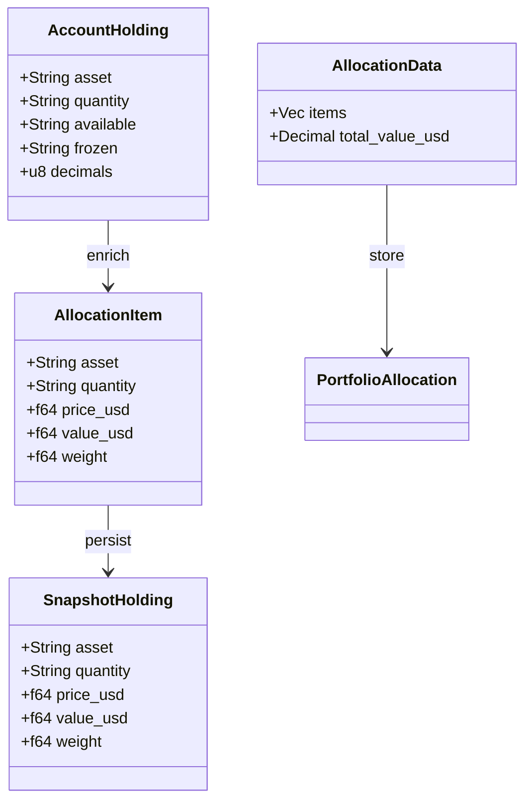
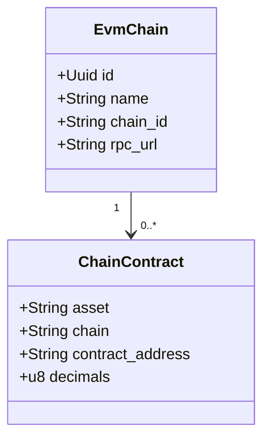

# Backend Architecture - Domain-Driven Design

## Layered Architecture (Domain Model)

---

## Domain Model Structure

### Portfolio Domain

---

### Asset Domain

---

### Holding and Allocation Domain

---

### Chain and Token Domain

