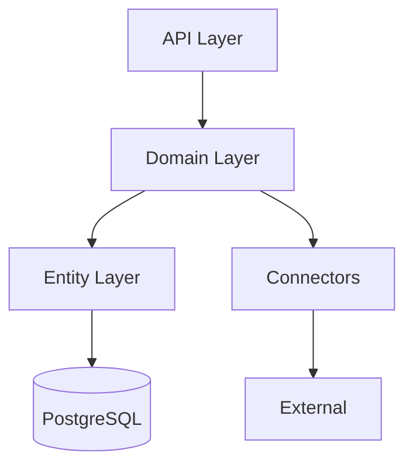
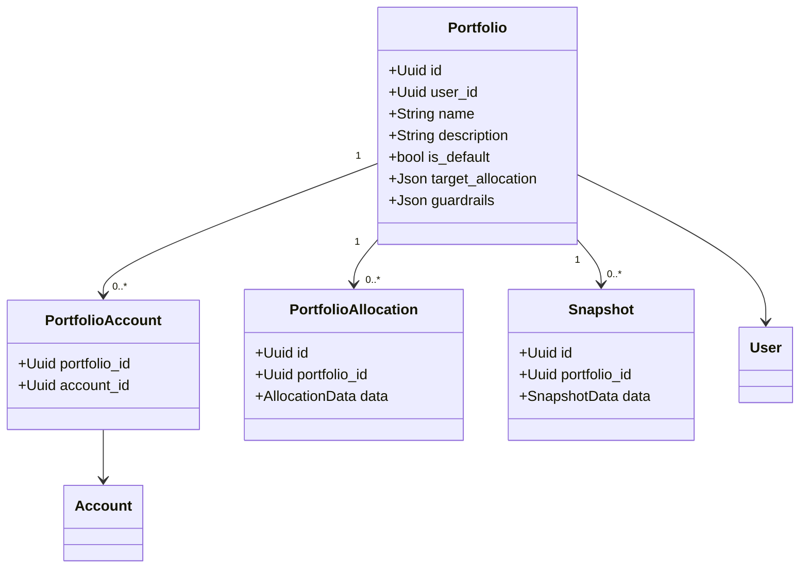
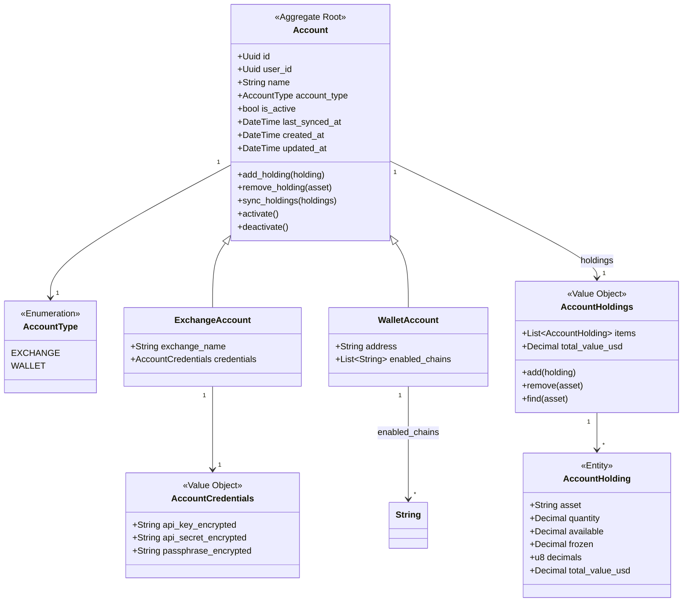
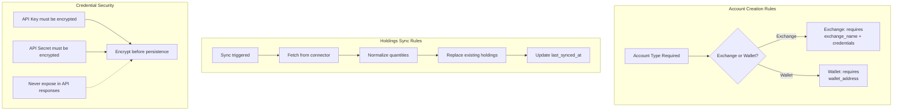
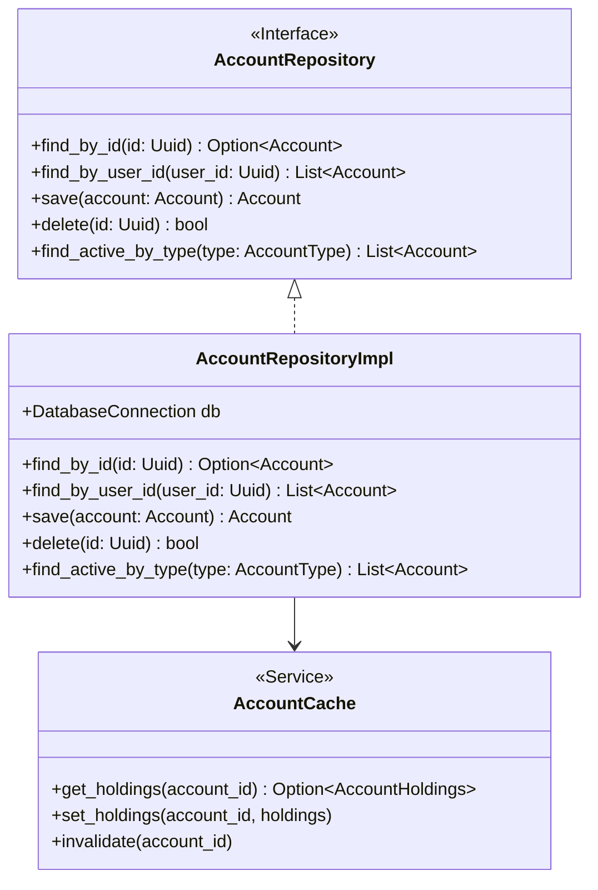
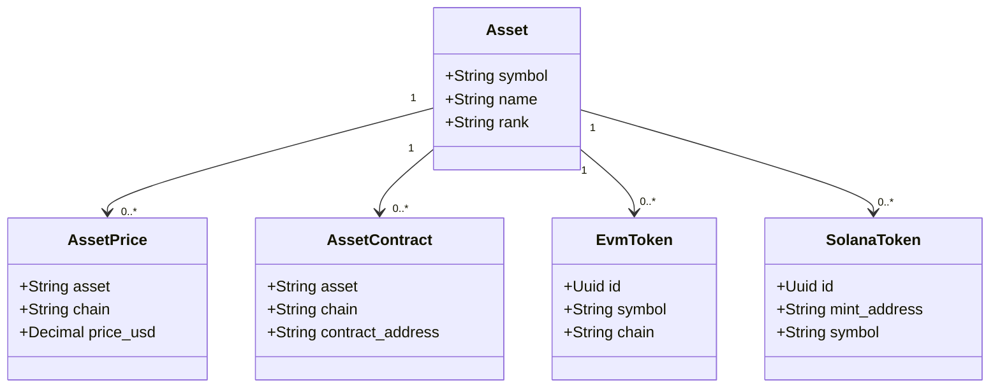
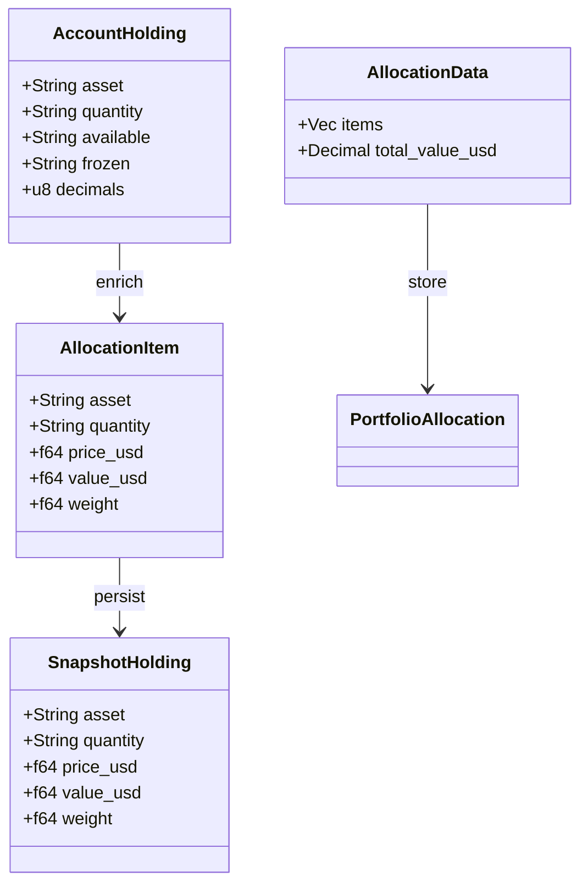
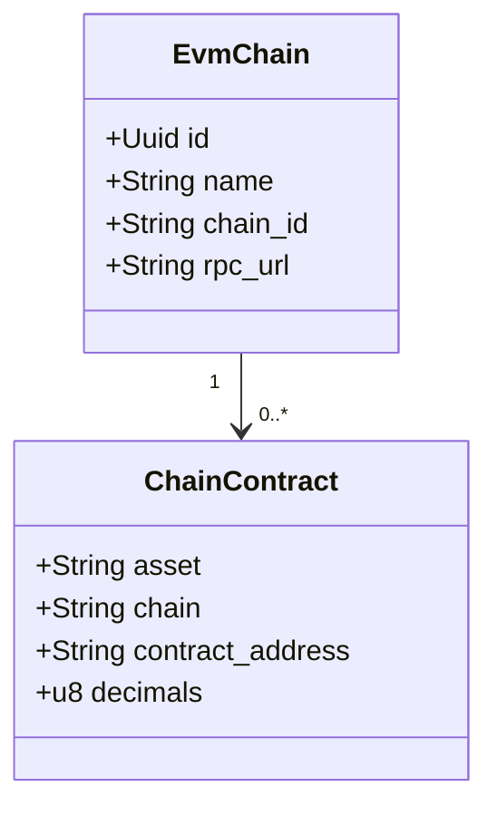

# Backend Architecture - Domain-Driven Design

## Layered Architecture (Domain Model)



---

## Domain Model Structure

### Portfolio Domain



---

### Account Domain

> **Bounded Context:** Account management, credentials, and holdings storage.
> **Aggregate Root:** Account



---

### Account Domain - Aggregate Boundaries

```mermaid
graph TB
    subgraph "Account Aggregate"
        A[Account<br/>Aggregate Root]
        H[AccountHoldings]
        AH[AccountHolding]
        
        A --> H
        H --> AH
    end
    
    subgraph "Value Objects"
        C[AccountCredentials]
        WA[WalletAddress]
        AT[AccountType]
    end
    
    subgraph "External References"
        U[User]
        P[Portfolio]
    end
    
    A --> C
    A --> WA
    A --> AT
    A -.-> U : belongs to
    P -.-> A : references
```

---

### Account Domain - Invariants & Business Rules



---

### Account Domain - Repository Interface



---

### Asset Domain



---

### Holding and Allocation Domain



---

### Chain and Token Domain



---

## Domain Relationships Overview

```mermaid
graph LR
    subgraph "User Context"
        U[User]
    end
    
    subgraph "Account Context"
        A[Account]
        AH[AccountHoldings]
    end
    
    subgraph "Portfolio Context"
        P[Portfolio]
        PA[PortfolioAccount]
        PS[PortfolioSnapshot]
    end
    
    subgraph "Asset Context"
        AS[Asset]
        AP[AssetPrice]
    end
    
    U --> A
    U --> P
    A --> AH
    P --> PA
    PA --> A
    PS --> AH : aggregates
    AH --> AS : references
    AS --> AP
```

---

## DDD Design Decisions

### Why Separate Account Domain?

1. **Single Responsibility**: Account management is a distinct bounded context with its own invariants
2. **Aggregate Root**: Account controls access to its holdings and credentials
3. **Type Safety**: Different account types (Exchange vs Wallet) have different constraints
4. **Security**: Credentials handling is isolated within the aggregate
5. **Testability**: Account domain logic can be tested independently

### Aggregate Boundaries

| Aggregate Root | Contains | Invariants |
|---------------|----------|------------|
| Account | AccountHoldings, Credentials | Holdings consistency, credential encryption |
| Portfolio | PortfolioAllocations, Snapshots | Allocation weights sum to 100% |
| Asset | AssetPrices, AssetContracts | Price uniqueness per chain |

### Value Objects

| Value Object | Purpose |
|-------------|---------|
| AccountCredentials | Encapsulates encrypted API credentials |
| AccountType | Enumeration of account types |
| WalletAddress | Validates and encapsulates wallet address |
| AccountHolding | Immutable holding snapshot |