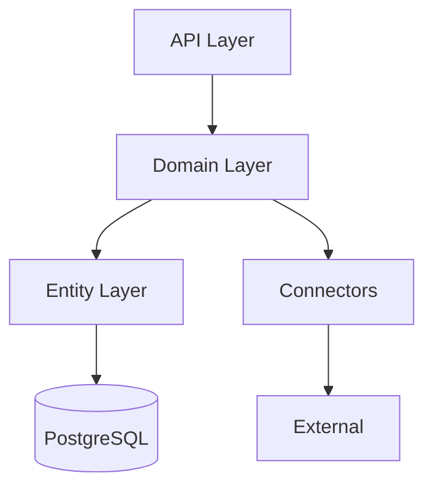

# Domain Models

This folder contains Domain-Driven Design documentation for each bounded context in the Crypto Pocket Butler system.

## Bounded Contexts

| Domain | File | Description |
|--------|------|-------------|
| Portfolio | [01-portfolio-domain.md](./01-portfolio-domain.md) | Portfolio management, allocations, snapshots |
| Account | [02-account-domain.md](./02-account-domain.md) | Account management, credentials, holdings |
| Asset | [03-asset-domain.md](./03-asset-domain.md) | Asset definitions, prices, contracts |
| Holding & Allocation | [04-holding-allocation-domain.md](./04-holding-allocation-domain.md) | Holdings enrichment, allocation calculation |
| Chain & Token | [05-chain-token-domain.md](./05-chain-token-domain.md) | Blockchain networks, token configurations |

## Layered Architecture



## Domain Relationships

```mermaid
graph LR
    subgraph "User Context"
        U[User]
    end
    
    subgraph "Account Context"
        A[Account]
        AH[AccountHoldings]
    end
    
    subgraph "Portfolio Context"
        P[Portfolio]
        PA[PortfolioAccount]
        PS[PortfolioSnapshot]
    end
    
    subgraph "Asset Context"
        AS[Asset]
        AP[AssetPrice]
    end
    
    U --> A
    U --> P
    A --> AH
    P --> PA
    PA --> A
    PS --> AH : aggregates
    AH --> AS : references
    AS --> AP
```

## Aggregate Root Summary

| Aggregate Root | Contains | Invariants |
|---------------|----------|------------|
| Account | AccountHoldings, Credentials | Holdings consistency, credential encryption |
| Portfolio | PortfolioAllocations, Snapshots | Allocation weights sum to 100% |
| Asset | AssetPrices, AssetContracts | Price uniqueness per chain |