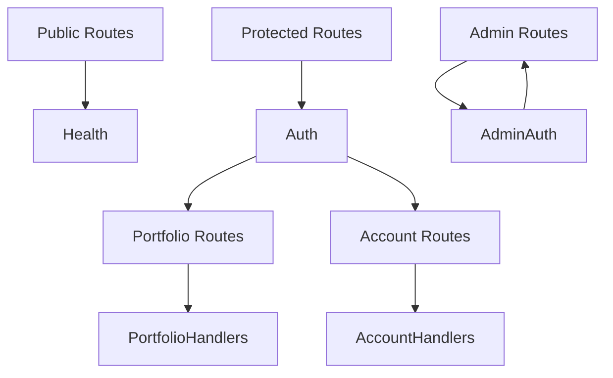
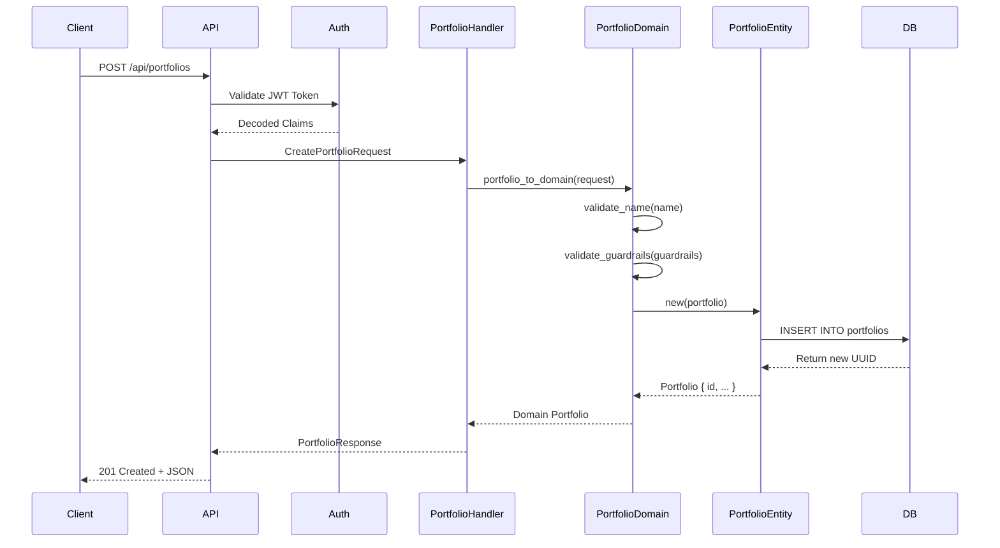
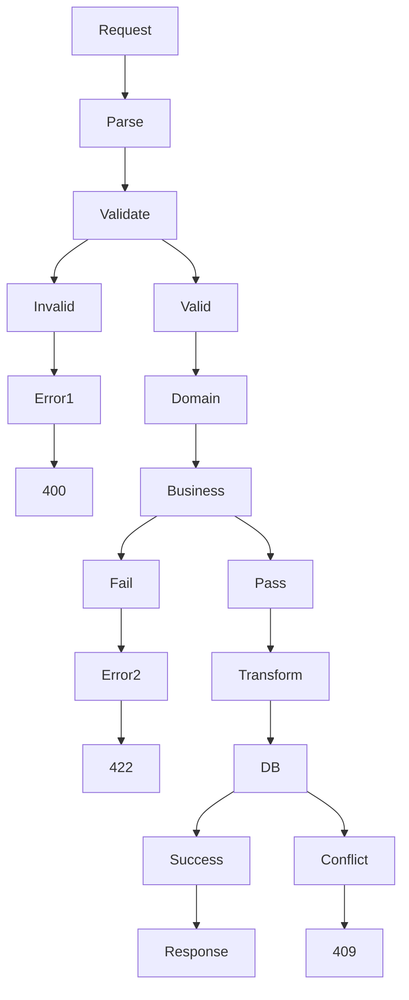
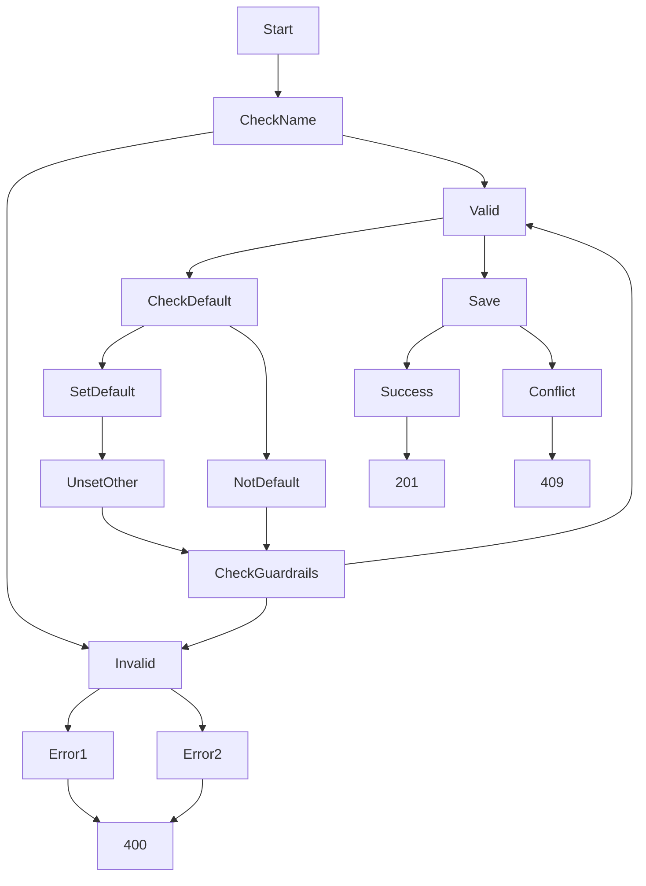

# Backend Architecture - API & Data Flow

## API Endpoint Architecture

```mermaid
graph TD
    PublicRoutes[Public Routes]
    ProtectedRoutes[Protected Routes]
    PortfolioRoutes[Portfolio Routes]
    AccountRoutes[Account Routes]
    AdminRoutes[Admin Routes]
    
    PublicRoutes --> Health
    ProtectedRoutes --> Auth
    PortfolioRoutes --> PortfolioHandlers
    AccountRoutes --> AccountHandlers
    AdminRoutes --> AdminAuth
    Auth --> PortfolioRoutes
    Auth --> AccountRoutes
    AdminAuth --> AdminRoutes
```

---

## Data Flow: Create Portfolio

```mermaid
sequenceDiagram
    Client->>API: POST /api/portfolios
    API->>Auth: Validate JWT Token
    Auth-->>API: Decoded Claims
    API->>PortfolioHandler: CreatePortfolioRequest
    PortfolioHandler->>PortfolioDomain: portfolio_to_domain(request)
    PortfolioDomain->>PortfolioDomain: validate_name(name)
    PortfolioDomain->>PortfolioDomain: validate_guardrails(guardrails)
    PortfolioDomain->>PortfolioEntity: new(portfolio)
    PortfolioEntity->>DB: INSERT INTO portfolios
    DB-->>PortfolioEntity: Return new UUID
    PortfolioEntity-->>PortfolioDomain: Portfolio { id, ... }
    PortfolioDomain-->>PortfolioHandler: Domain Portfolio
    PortfolioHandler-->>API: PortfolioResponse
    API-->>Client: 201 Created + JSON
```

---

## Domain Model Validation Flow

```mermaid
graph TD
    Request --> Parse
    Parse --> Validate
    Validate --> Valid
    Valid --> Domain
    Domain --> Business
    Business --> Pass
    Pass --> Transform
    Transform --> DB
    DB --> Success
    Validate --> Invalid
    Invalid --> Error1
    Business --> Fail
    Fail --> Error2
    DB --> Conflict
    Error1 --> 400
    Error2 --> 422
    Conflict --> 409
    Success --> Response
```

---

## Business Rules Validation

```mermaid
flowchart TD
    Start --> CheckName
    CheckName --> Invalid --> Error1
    CheckName --> Valid --> CheckDefault
    CheckDefault --> SetDefault --> UnsetOther
    CheckDefault --> NotDefault --> CheckGuardrails
    UnsetOther --> CheckGuardrails
    CheckGuardrails --> Invalid --> Error2
    CheckGuardrails --> Valid --> Save
    Save --> Success
    Save --> Conflict
    Error1 --> 400
    Error2 --> 400
    Success --> 201
    Conflict --> 409
```
