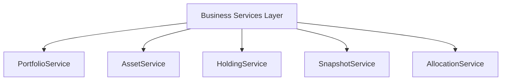
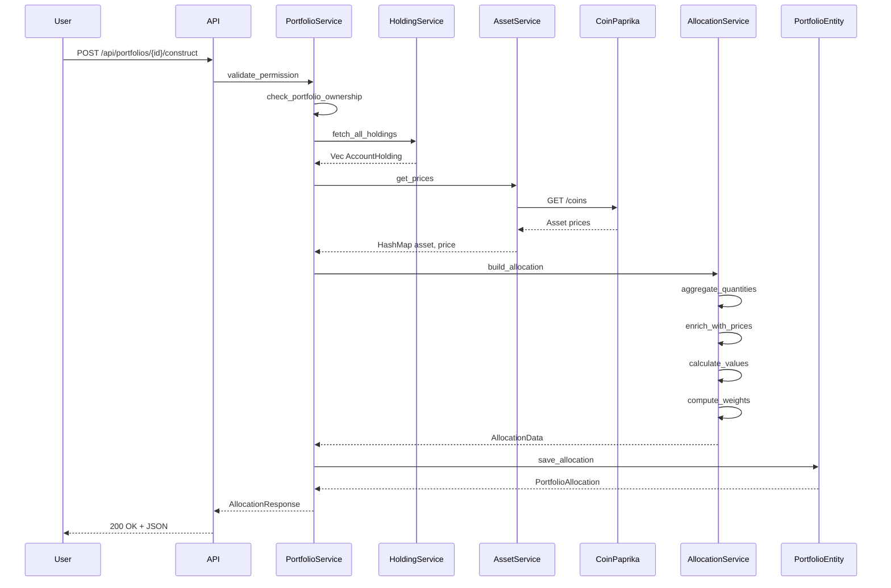
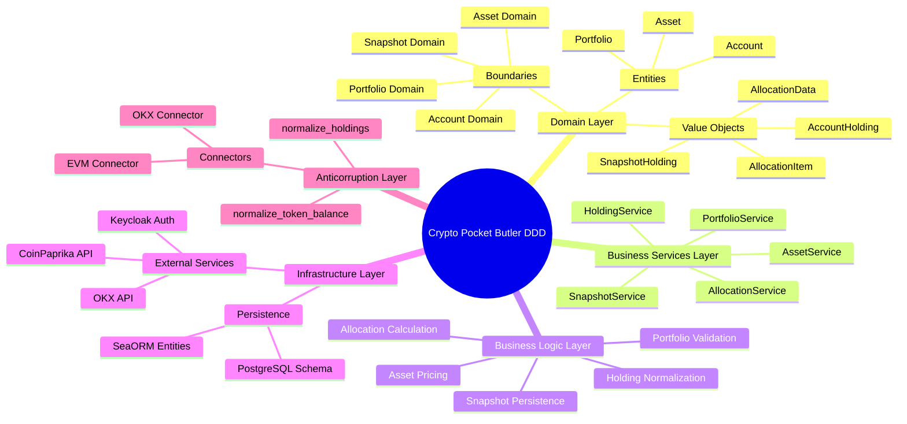

# Backend Architecture - Business Services & Logic

## Business Services Layer

---

## Business Logic Layer

```mermaid
graph TD
    PBL[Portfolio Business Logic]
    ABL[Asset Business Logic]
    HBL[Holding Business Logic]
    ALBL[Allocation Business Logic]
    SBL[Snapshot Business Logic]
    
    VN[ValidateName]
    CD[CheckDefault]
    VG[ValidateGuardrails]
    CO[CheckOwnership]
    
    LP[LookUpPrices]
    NS[NormalizeSymbols]
    CM[CheckChainMapping]
    
    NQ[NormalizeQuantities]
    CA[CalculateAvailable]
    MA[MergeAccounts]
    
    AH[AggregateHoldings]
    EP[EnrichWithPrices]
    CV[CalculateValues]
    CW[ComputeWeights]
    
    CC[CreateCopy]
    PS[PreserveState]
    GM[GenerateMetadata]
    
    PBL --> VN
    PBL --> CD
    PBL --> VG
    PBL --> CO
    
    ABL --> LP
    ABL --> NS
    ABL --> CM
    
    HBL --> NQ
    HBL --> CA
    HBL --> MA
    
    ALBL --> AH
    ALBL --> EP
    ALBL --> CV
    ALBL --> CW
    
    SBL --> CC
    SBL --> PS
    SBL --> GM
```

---

## High-Level Business Flow: Portfolio Construction

---

## Domain-Driven Design Principles Applied

