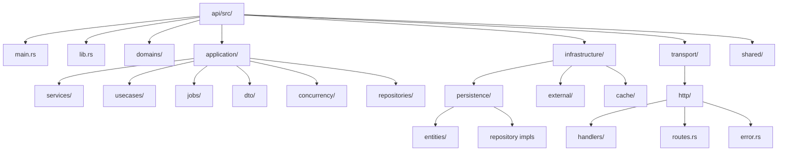
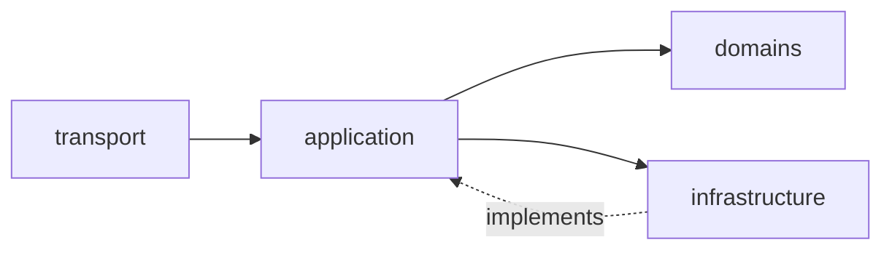
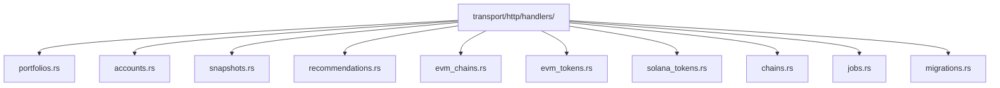
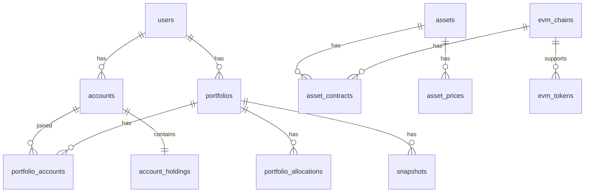

# Backend Architecture - Code Structure

## Code Structure Design

---

## Layer Dependency Flow

---

## HTTP Handler Structure

---

## Database Entity Relationships

---

## Layer Descriptions

| Layer | Location | Responsibility |
|-------|----------|----------------|
| **Domain Layer** | `api/src/domains/` | Business entities and rules, no external dependencies |
| **Application Layer** | `api/src/application/` | Use cases, services, repository traits, orchestration |
| **Infrastructure Layer** | `api/src/infrastructure/` | Persistence, external APIs, caching — implements application interfaces |
| **Transport Layer** | `api/src/transport/` | HTTP handlers, routes, error mapping |

---

## Clean Architecture Principles

### Dependency Direction Rules

Dependencies always point **inward**: Transport → Application → Domain. Infrastructure implements interfaces defined by the Application layer, so the domain and application layers never depend on infrastructure details.

### Why Handlers Don't Call Infrastructure Directly

HTTP handlers (in `transport/http/handlers/`) receive injected use cases and services via Axum `Extension` state. They never import from `infrastructure/` directly. This keeps the transport layer decoupled from persistence and external-API concerns, making handlers independently testable.

### Repository Pattern

Repository *traits* are declared in `application/repositories/` (e.g. `AccountRepository`, `PortfolioRepository`). Concrete implementations live in `infrastructure/persistence/` (e.g. `AccountRepositoryImpl`). The application layer depends only on the trait, not the implementation.

### Use Case Pattern

Each domain-facing operation is encapsulated in a use-case struct under `application/usecases/` (e.g. `AccountUseCases`, `ChainUseCases`, `PortfolioUseCases`). Use cases are constructed once at startup in `main.rs`, wrapped in `Arc`, and shared across handlers via Axum `Extension` injection.