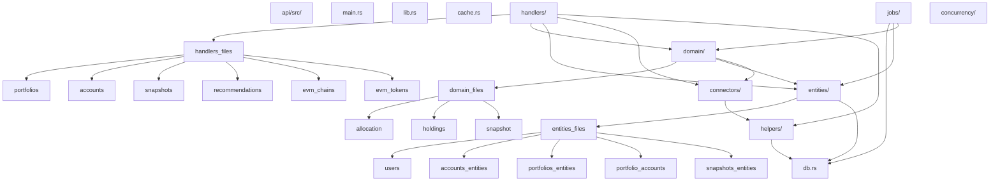
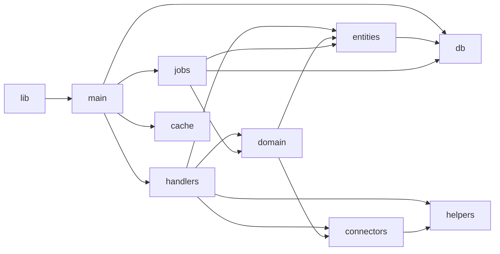
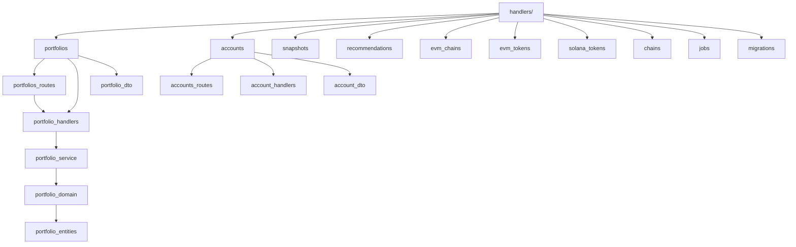
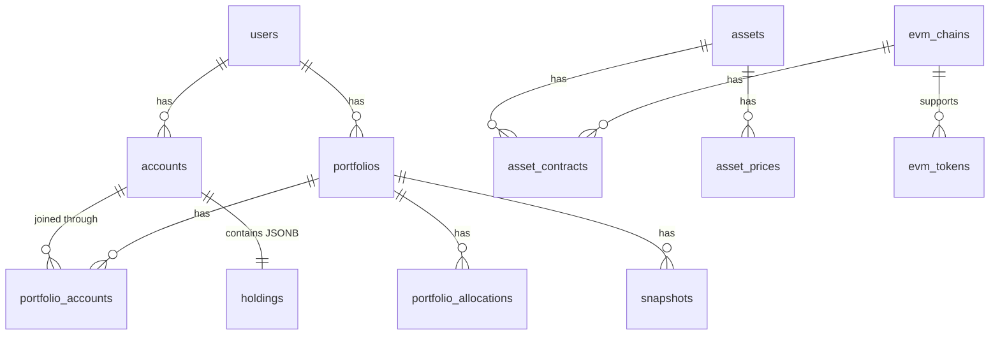

# Backend Architecture - Code Structure

## Code Structure Design

```mermaid
graph TB
    api_src[api/src/]
    main[main.rs]
    lib[lib.rs]
    db[db.rs]
    cache[cache.rs]
    handlers[handlers/]
    domain[domain/]
    entities[entities/]
    connectors[connectors/]
    helpers[helpers/]
    jobs[jobs/]
    concurrency[concurrency/]
    
    handlers --> handlers_files
    handlers_files --> portfolios
    handlers_files --> accounts
    handlers_files --> snapshots
    handlers_files --> recommendations
    handlers_files --> evm_chains
    handlers_files --> evm_tokens
    
    domain --> domain_files
    domain_files --> allocation
    domain_files --> holdings
    domain_files --> snapshot
    
    entities --> entities_files
    entities_files --> users
    entities_files --> accounts_entities
    entities_files --> portfolios_entities
    entities_files --> portfolio_accounts
    entities_files --> snapshots_entities
    
    handlers --> domain
    handlers --> entities
    handlers --> connectors
    handlers --> helpers
    
    domain --> entities
    domain --> connectors
    
    entities --> db
    connectors --> helpers
    helpers --> db
    jobs --> db
    jobs --> entities
    jobs --> domain
```

---

## Module Dependency Flow

```mermaid
graph LR
    lib --> main
    main --> handlers
    main --> db
    main --> jobs
    main --> cache
    handlers --> domain
    handlers --> entities
    handlers --> connectors
    handlers --> helpers
    domain --> entities
    domain --> connectors
    entities --> db
    connectors --> helpers
    jobs --> db
    jobs --> entities
    jobs --> domain
```

---

## API Handler Structure

```mermaid
graph TD
    handlers[handlers/]
    handlers --> portfolios
    handlers --> accounts
    handlers --> snapshots
    handlers --> recommendations
    handlers --> evm_chains
    handlers --> evm_tokens
    handlers --> solana_tokens
    handlers --> chains
    handlers --> jobs
    handlers --> migrations
    
    portfolios --> portfolios_routes
    portfolios --> portfolio_handlers
    portfolios --> portfolio_dto
    
    accounts --> accounts_routes
    accounts --> account_handlers
    accounts --> account_dto
    
    portfolios_routes --> portfolio_handlers
    portfolio_handlers --> portfolio_service
    portfolio_service --> portfolio_domain
    portfolio_domain --> portfolio_entities
```

---

## Database Entity Relationships

```mermaid
erDiagram
    users ||--o{ accounts : "has"
    users ||--o{ portfolios : "has"
    accounts ||--o{ portfolio_accounts : "joined through"
    portfolios ||--o{ portfolio_accounts : "has"
    
    portfolios ||--o{ portfolio_allocations : "has"
    portfolios ||--o{ snapshots : "has"
    
    accounts ||--|| holdings : "contains JSONB"
    
    assets ||--o{ asset_contracts : "has"
    assets ||--o{ asset_prices : "has"
    
    evm_chains ||--o{ evm_tokens : "supports"
    evm_chains ||--o{ asset_contracts : "has"
```
