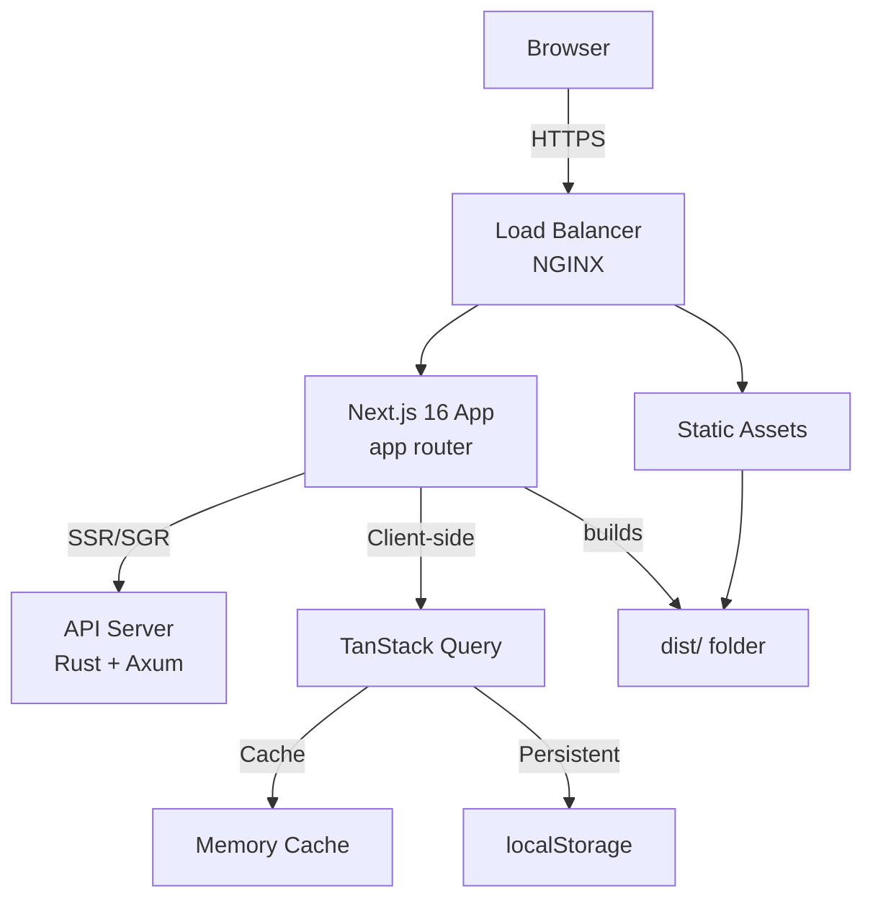
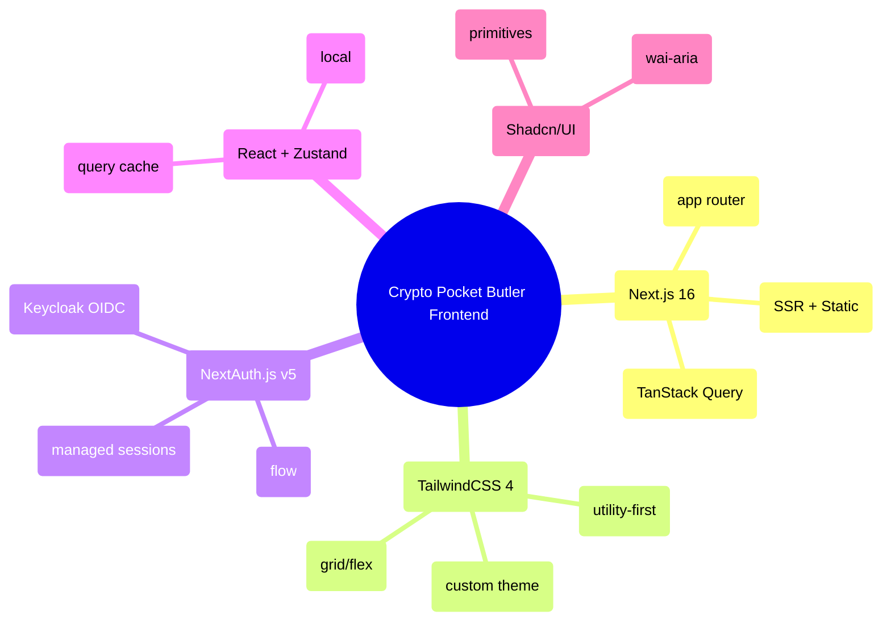
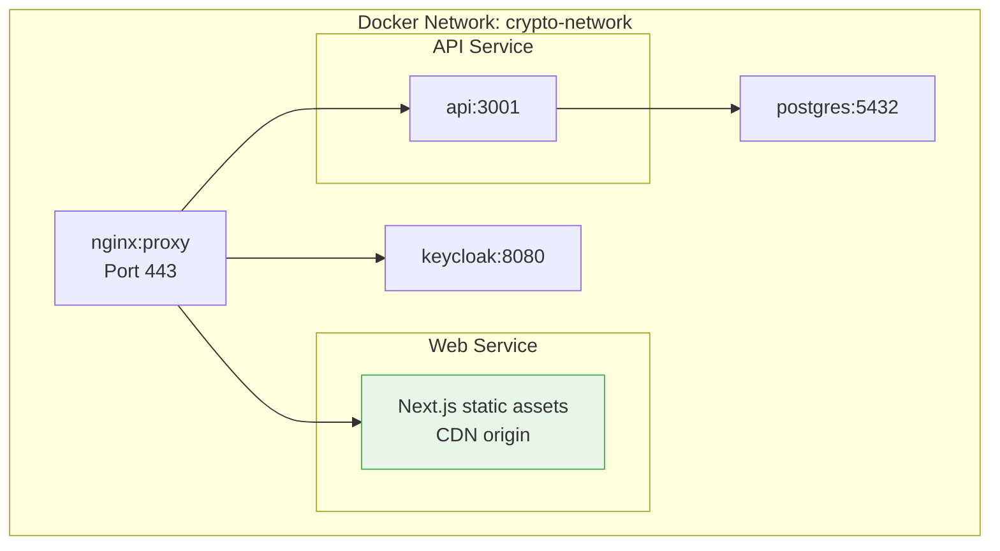
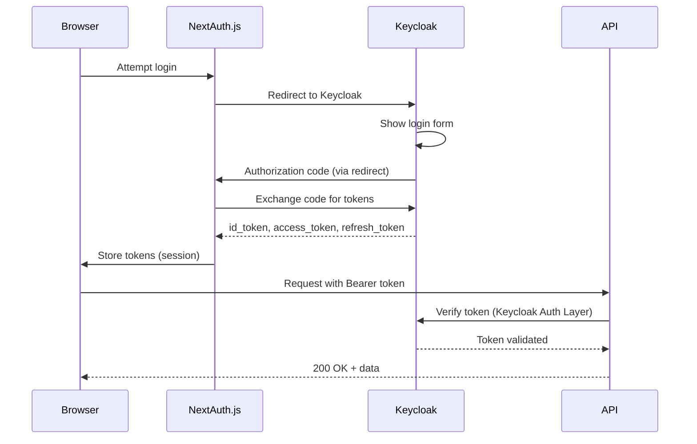
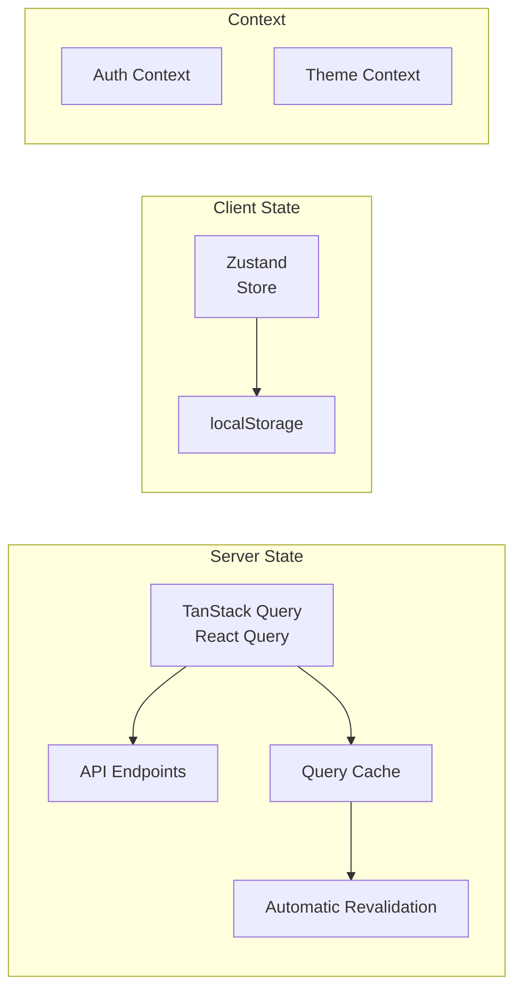
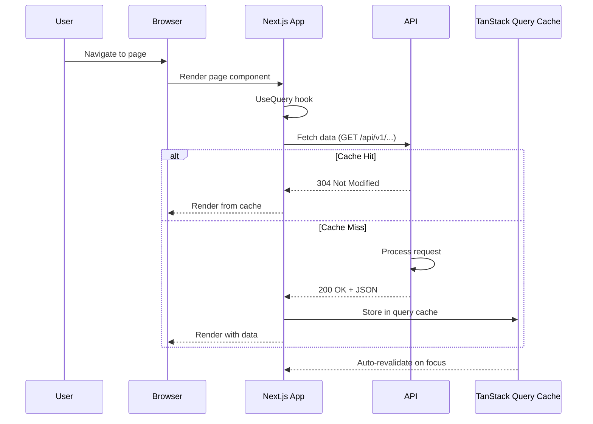
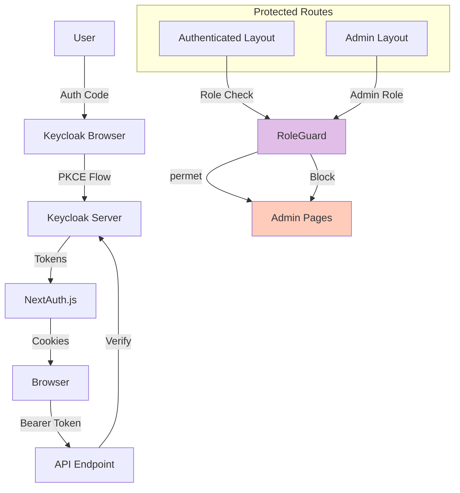
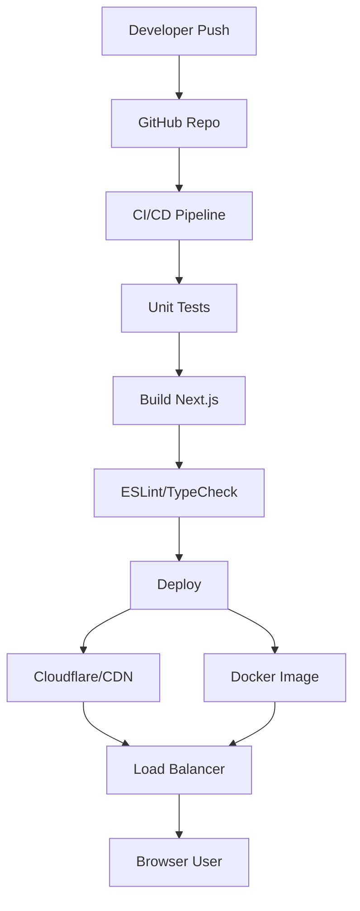
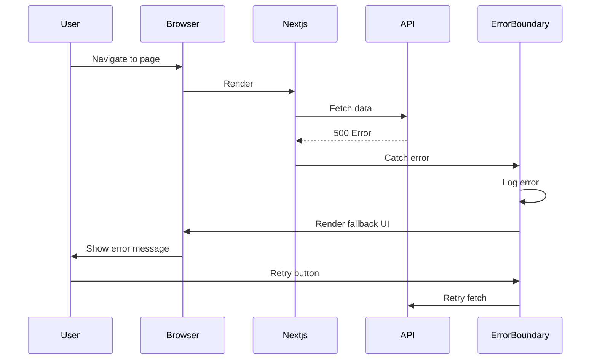

# Crypto Pocket Butler Web (Frontend) Architecture

## High-Level Web Architecture



---

## Frontend Technology Stack



---

## Web Deployment Architecture



---

## Frontend Data Flow: Authentication



---

## Frontend Component Structure

```mermaid
graph TD
    App[app/layout.tsx]
    
    App --> Layout[App Layout]
    Layout --> Header[Header Component]
    Layout --> Sidebar[Sidebar Navigation]
    
    App --> Page[app/page/page.tsx]
    Page --> PortfolioList[Portfolio List]
    Page --> PortfolioStats[Portfolio Stats]
    
    App --> Portfolio[app/portfolios/[id]/page.tsx]
    Portfolio --> PortfolioDetail[Portfolio Detail]
    Portfolio --> Holdings[Holdings Table]
    Portfolio --> Allocation[Allocation Chart]
    
    App --> Accounts[app/accounts/page.tsx]
    Accounts --> AccountList[Account List]
    Accounts --> AccountForm[Account Form]
    
    App --> Admin[app/admin/layout.tsx]
    Admin --> Dashboard[apalis-board Dashboard]
```

---

## Frontend State Management



---

## Frontend Response Flow



---

## Frontend Security Architecture



---

## Frontend Deployment Flow (CI/CD)



---

## Frontend Routing Strategy

```mermaid
graph TD
    App[app/layout.tsx]
    App --> Root[app/page.tsx<br/>Home/Portfolio]
    
    App --> Portfolios[app/portfolios/layout.tsx]
    Portfolios --> List[app/portfolios/page.tsx<br/>List]
    Portfolios --> Detail[app/portfolios/[id]/page.tsx<br/>Detail]
    
    App --> Accounts[app/accounts/layout.tsx]
    Accounts --> List[app/accounts/page.tsx<br/>List]
    Accounts --> Form[app/accounts/:id/page.tsx<br/>Form/Detail]
    
    App --> Chains[app/evm-chains/layout.tsx]
    Chains --> List[app/evm-chains/page.tsx<br/>List]
    
    App --> Admin[app/admin/layout.tsx]
    Admin --> Board[app/admin/board/page.tsx<br/>apalis-board]
```

---

## Frontend Error Boundary Flow

