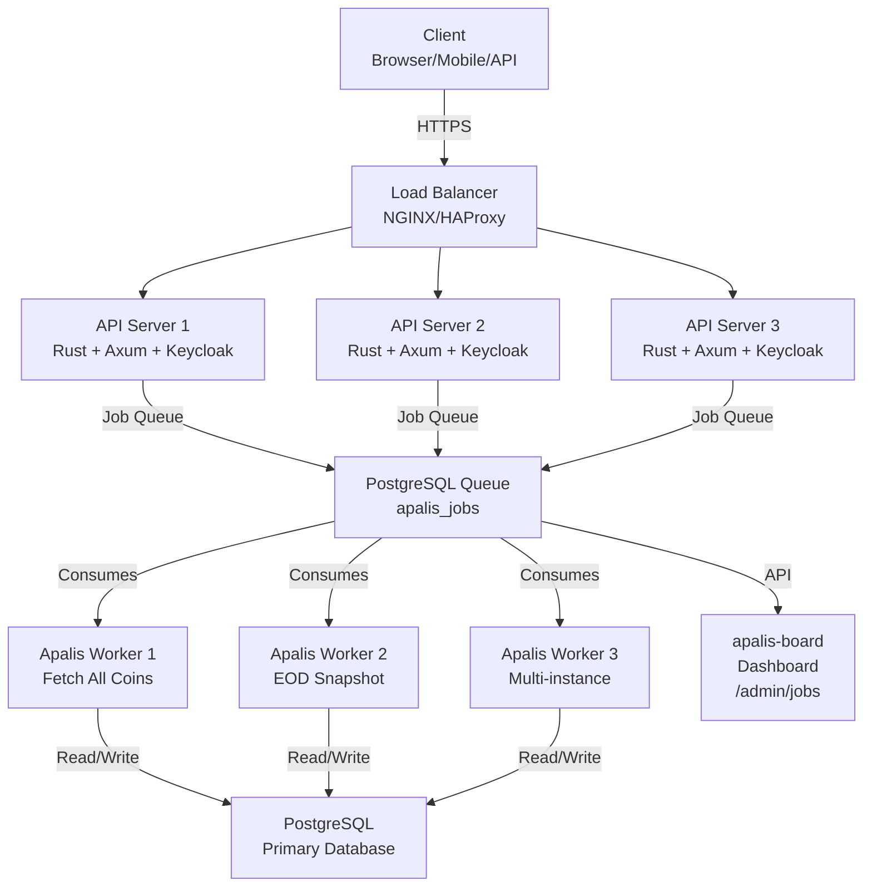
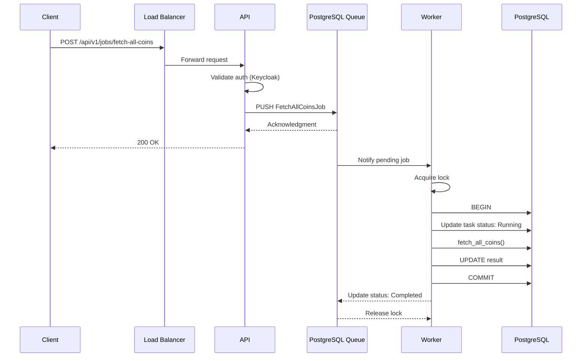
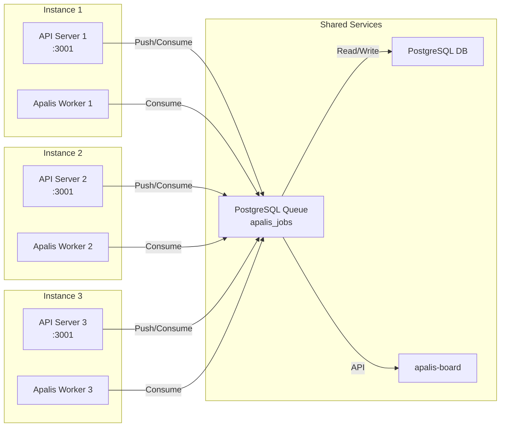
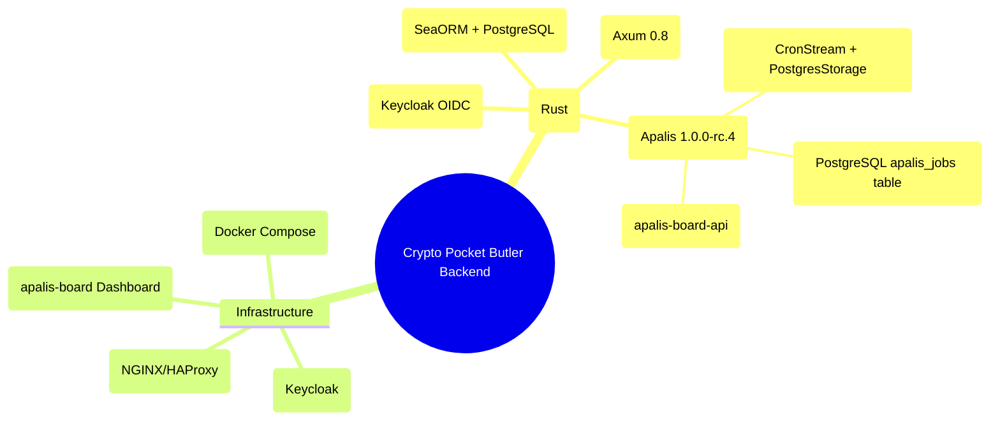
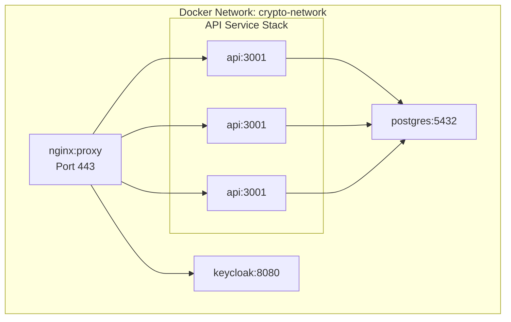
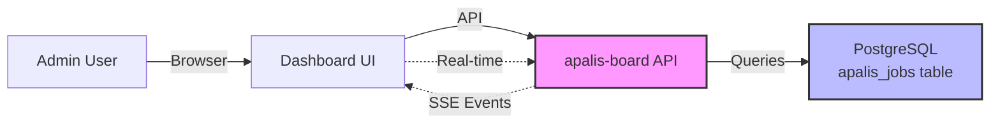
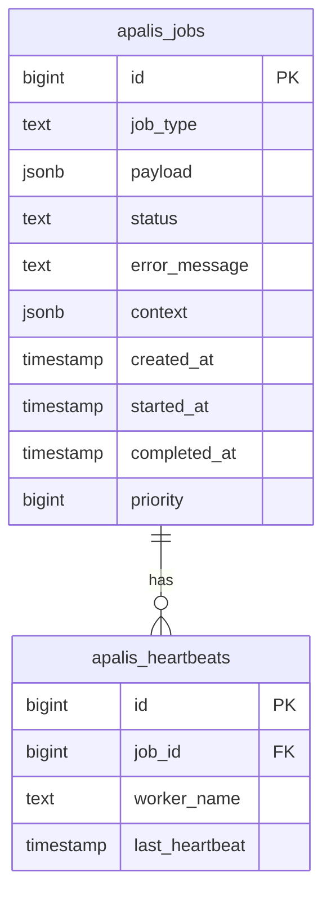
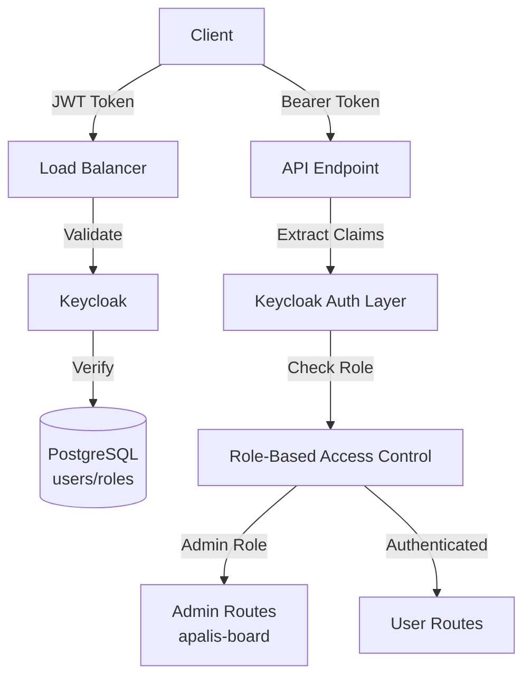

# Crypto Pocket Butler Backend API Architecture

## High-Level API Architecture

---

## API Data Flow: Job Processing

---

## Multi-Instance API Architecture

---

## Backend Technology Stack

---

## Backend Deployment (Docker)

---

## Backend Component Details: apalis-board

---

## Backend Job Storage Schema

---

## Backend Security Architecture

