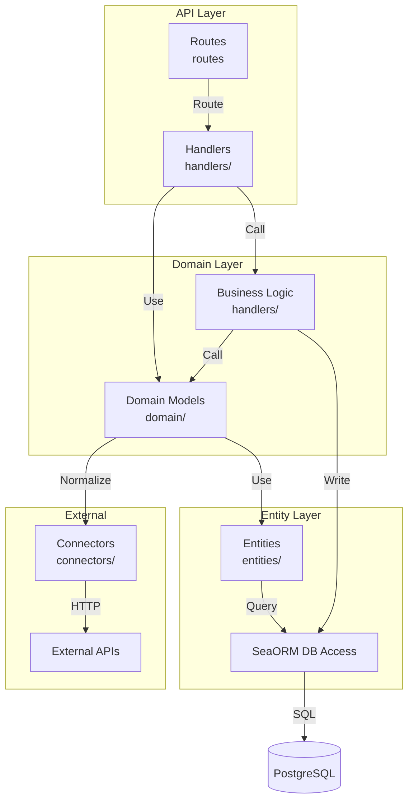
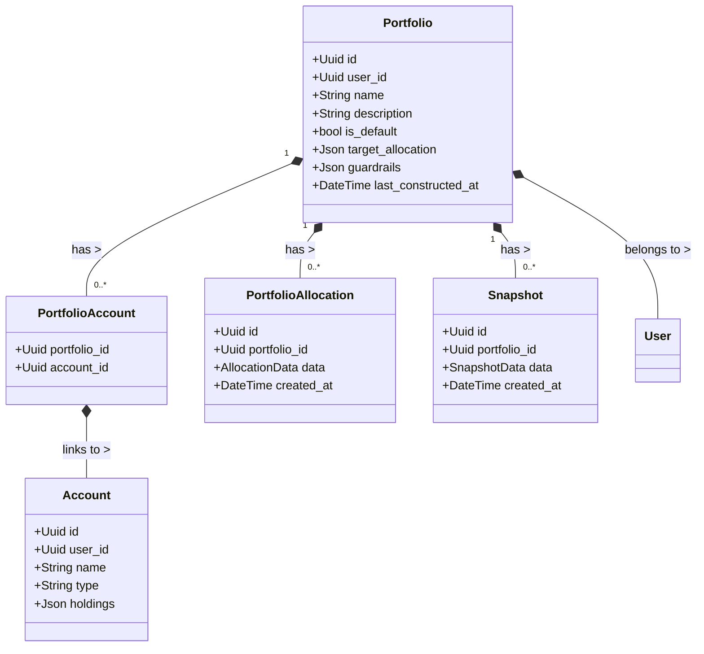
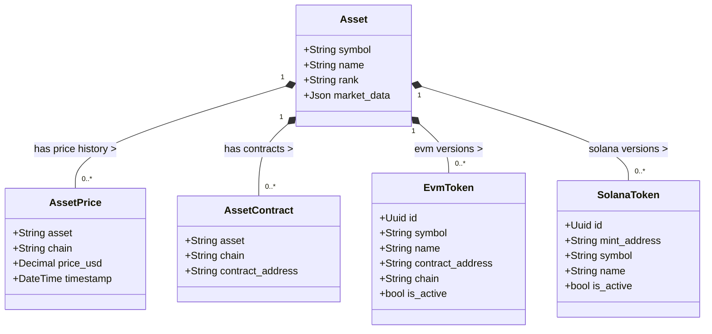
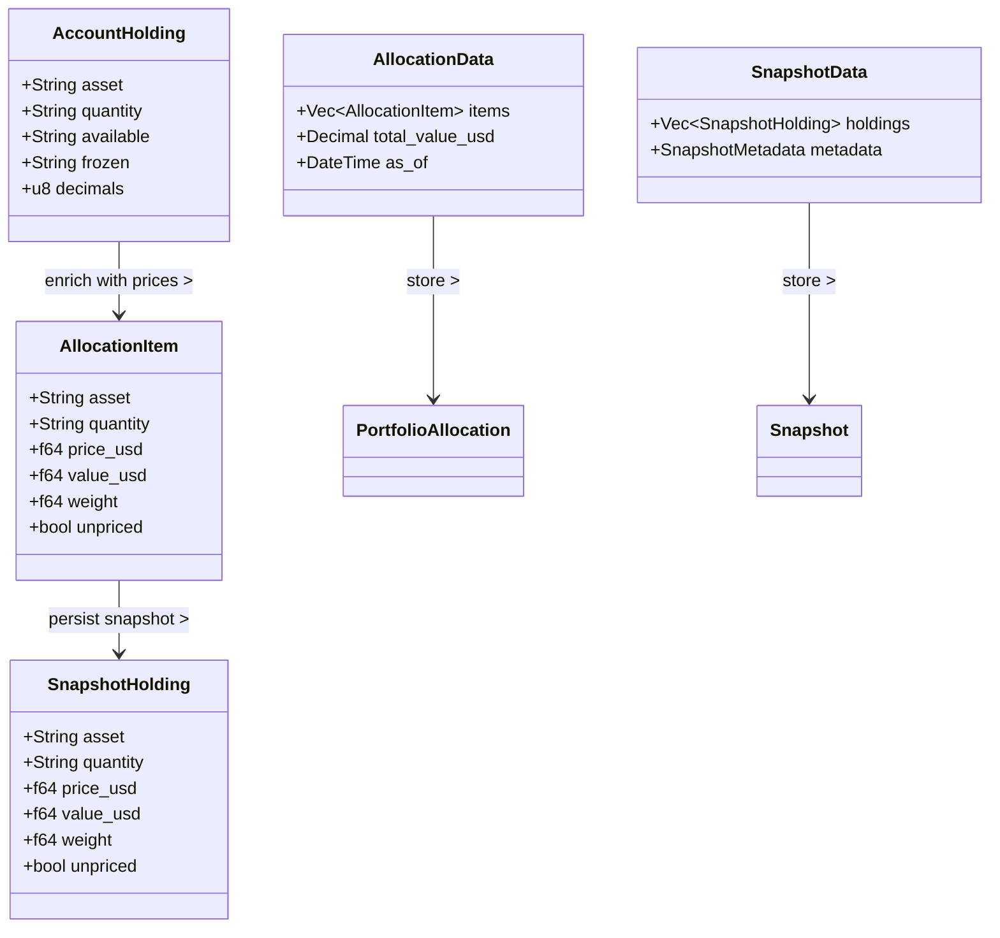
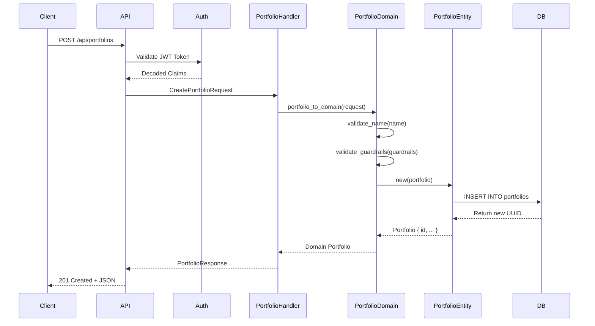
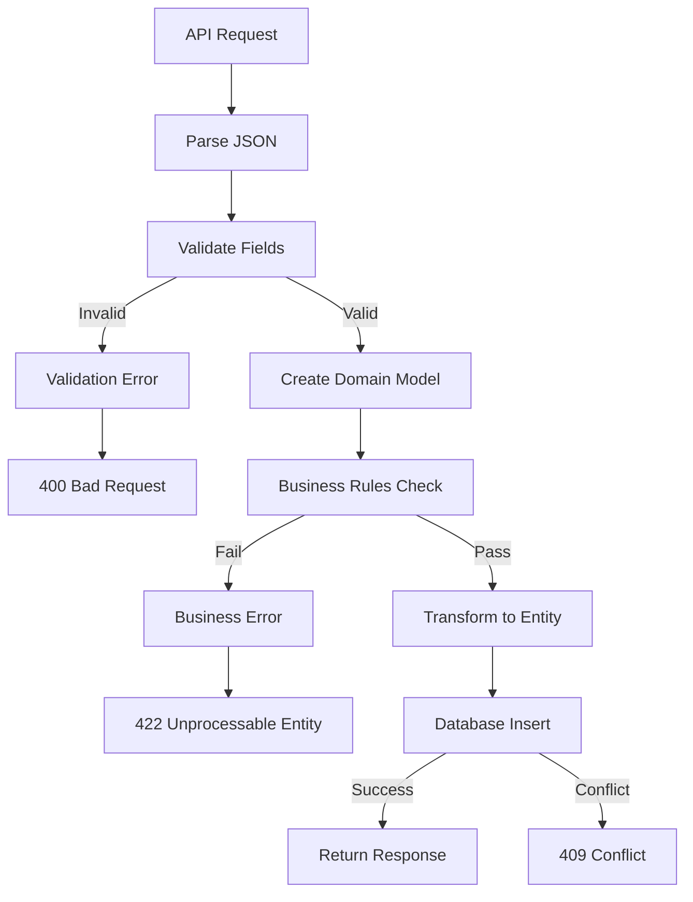
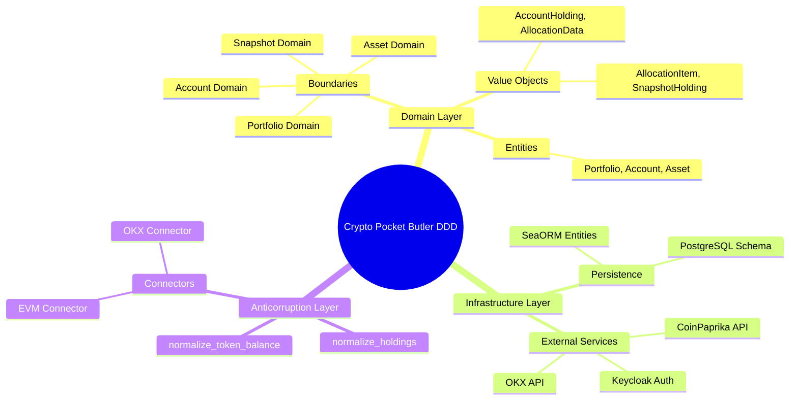

# Crypto Pocket Butler Backend API Architecture

## Domain-Driven Architecture

### Layered Architecture (Domain Model)



---

## Domain Model Structure

### Portfolio Domain



---

### Asset Domain



---

### Holding & Allocation Domain



---

### Chain & Token Domain

```mermaid
classDiagram
    class EvmChain {
        +Uuid id
        +String name
        +String chain_id
        +String rpc_url
        +String block_explorer
        +bool is_active
    }
    
    class ChainContract {
        +String asset
        +String chain
        +String contract_address
        +u8 decimals
    }
    
    EvmChain "1" *-- "0..*" ChainContract : supports >
    
    note right of EvmChain
        EVM chains:
        - Ethereum
        - BSC
        - Polygon
        - Arbitrum
        - Optimism
        - Base
    end note
```

---

## API Endpoint Architecture

```mermaid
graph TB
    subgraph "Public Routes"
        P1[GET /<br/>Root]
        P2[GET /health<br/>Health Check]
    end
    
    subgraph "Protected Routes (Any Auth)"
        A1[GET /api/me<br/>User Info]
        A2[GET /api/protected<br/>Protected]
    end
    
    subgraph "Portfolio Routes"
        PF1[GET /api/portfolios<br/>List]
        PF2[GET /api/portfolios/{id}<br/>Detail]
        PF3[POST /api/portfolios<br/>Create]
        PF4[PUT /api/portfolios/{id}<br/>Update]
        PF5[DELETE /api/portfolios/{id}<br/>Delete]
    end
    
    subgraph "Account Routes"
        ACC1[GET /api/accounts<br/>List]
        ACC2[GET /api/accounts/{id}<br/>Detail]
        ACC3[POST /api/accounts<br/>Create]
        ACC4[PUT /api/accounts/{id}<br/>Update]
        ACC5[POST /api/accounts/{id}/sync<br/>Sync]
    end
    
    subgraph "Admin Routes (Admin Role)"
        AD1[GET /admin/jobs<br/>apalis-board]
        AD2[POST /api/v1/jobs/fetch-all-coins<br/>Manual Job]
    end
    
    P1 --> H[Handler]
    P2 --> H
    A1 --> K[Keycloak Auth]
    A2 --> K
    PF1 --> K
    PF2 --> K
    PF3 --> K
    PF4 --> K
    PF5 --> K
    ACC1 --> K
    ACC2 --> K
    ACC3 --> K
    ACC4 --> K
    ACC5 --> K
    AD1 --> A[Admin Auth]
    AD2 --> A
    
    K --> RBAC[Role Check]
    A --> RBAC
    RBAC -->|User Role| PF1
    RBAC -->|User Role| ACC1
    RBAC -->|Admin Role| AD1
```

---

## Data Flow: Create Portfolio



---

## Domain Model Validation Flow



---

## Domain-Driven Design Principles Applied

